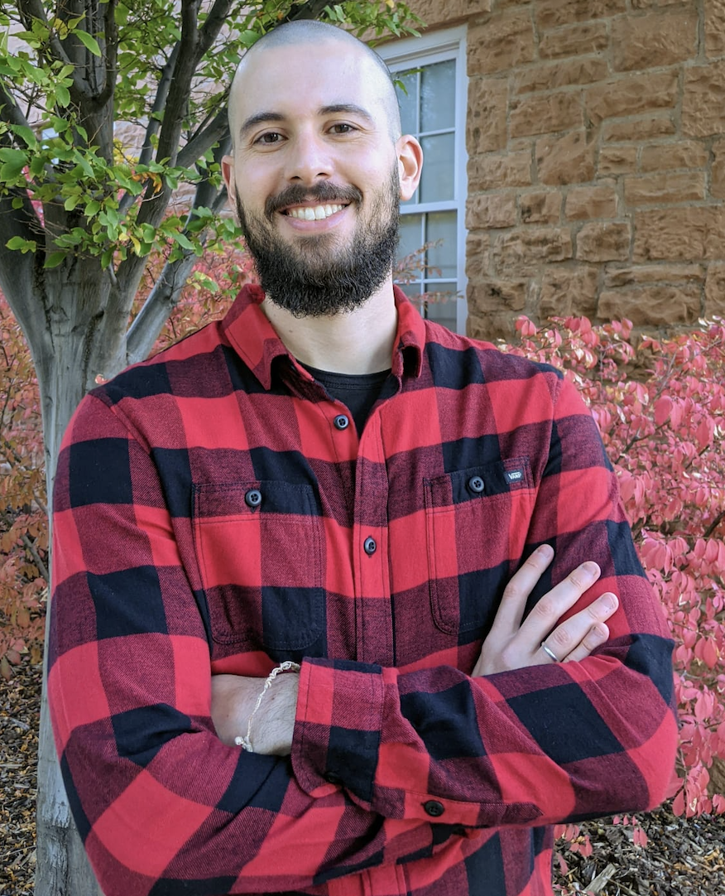

class: inverse, middle


```{r Setup, include = F}
options(htmltools.dir.version = FALSE)
library(pacman)
p_load(broom, latex2exp, ggplot2, ggthemes, ggforce, viridis, dplyr, magrittr, knitr, parallel, xaringanExtra, tidyverse, sjPlot, showtext, mathjaxr, ggforce, furrr, kableExtra, wooldridge, hrbrthemes, scales, ggeasy, patchwork)


# Knitr options
opts_chunk$set(
  comment = "#>",
  fig.align = "center",
  fig.height = 7,
  fig.width = 10.5,
  warning = F,
  message = F,
  dpi=300
)

theme_set(theme_ipsum_rc())

```

class: middle, center, inverse

.huge[.huge[.huge[Hello!]]]


---
class: middle, center, inverse


.huge[.b[Marcio Santetti, Ph.D.]]

<br>




[`r fontawesome::fa("envelope")` msantetti@skidmore.edu](mailto:msantetti@skidmore.edu)

---
layout: false
class: inverse, middle


# Motivation


---

# Housekeeping


---

layout: false
class: inverse, middle

# Next time: All-things "capitalism"


---
exclude: true

