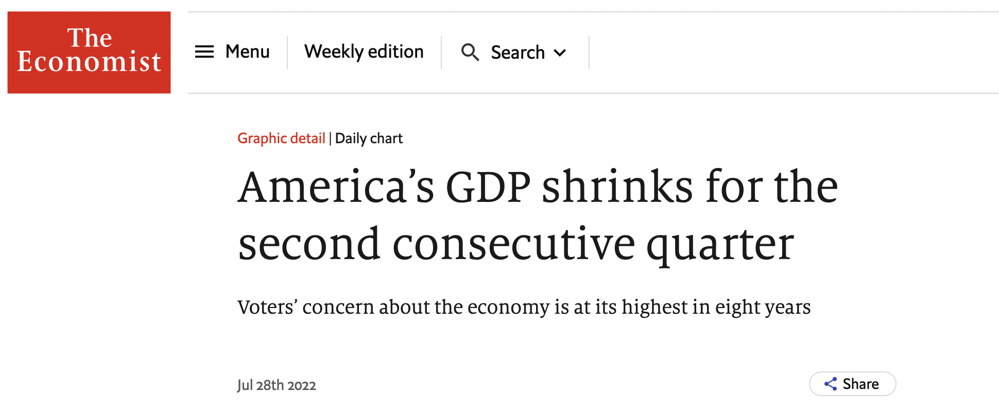
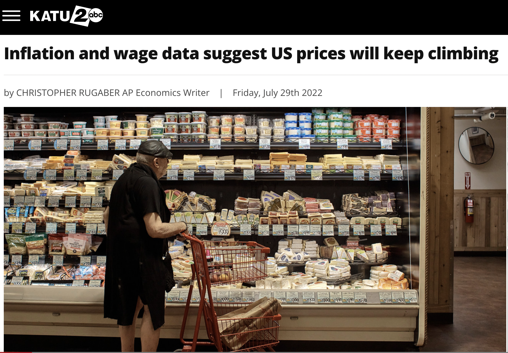
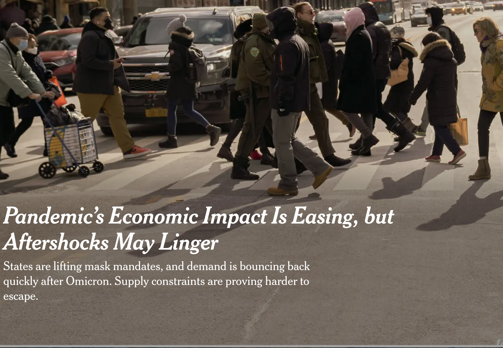
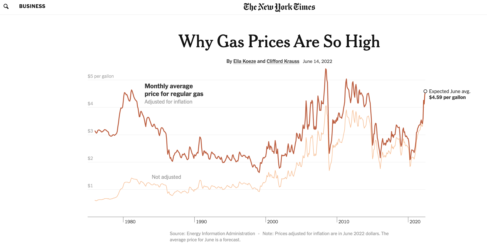
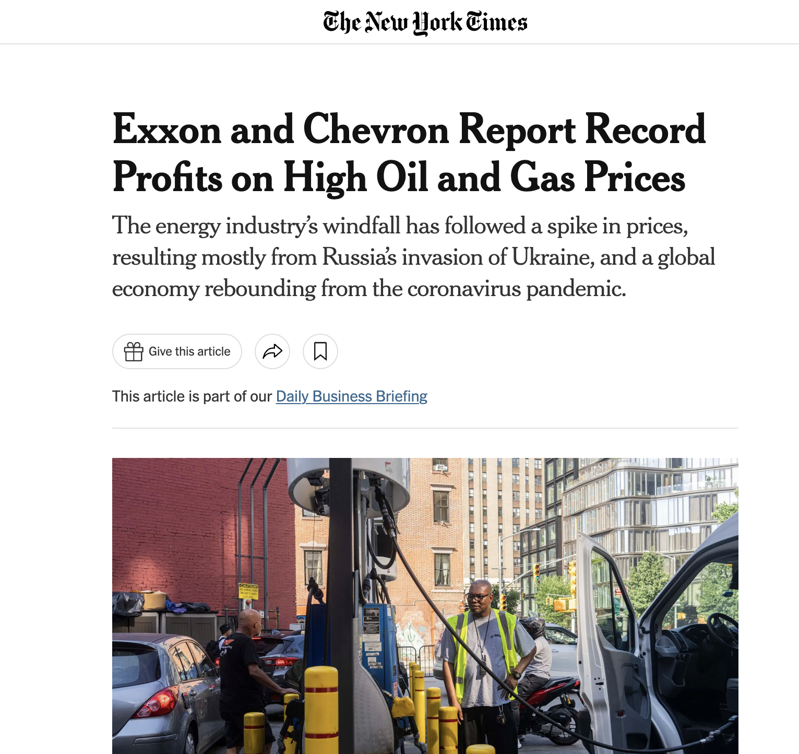
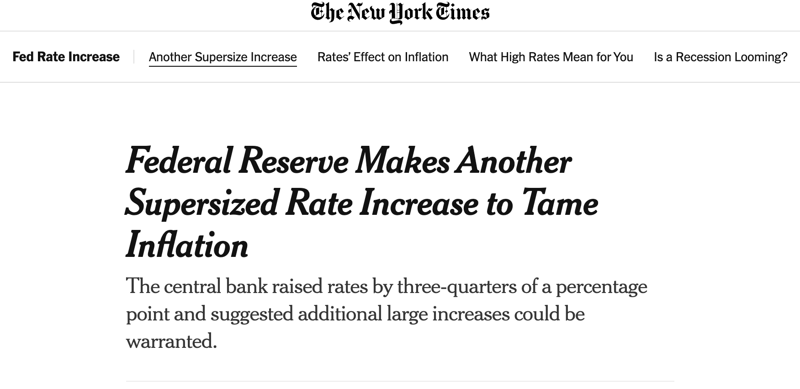

class: inverse, middle


```{r Setup, include = F}
options(htmltools.dir.version = FALSE)
library(pacman)
p_load(broom, latex2exp, ggplot2, ggthemes, ggforce, viridis, dplyr, magrittr, knitr, parallel, xaringanExtra, tidyverse, sjPlot, showtext, mathjaxr, ggforce, furrr, kableExtra, wooldridge, hrbrthemes, scales, ggeasy, patchwork)


# Knitr options
opts_chunk$set(
  comment = "#>",
  fig.align = "center",
  fig.height = 7,
  fig.width = 10.5,
  warning = F,
  message = F,
  dpi=300
)

theme_set(theme_ipsum_rc())

```

class: middle, center, inverse

.huge[.huge[.huge[.b[Hello!]]]]


---
class: middle, center, inverse


.huge[.b[Marcio Santetti, Ph.D. (*he/him*)]]

<br>


[`r fontawesome::fa("envelope")` msantetti@skidmore.edu](mailto:msantetti@skidmore.edu)

---
layout: false
class: inverse, middle


# Motivation


---


.center[

]


---


.center[

]

---


.center[

]


---


.center[

]


---


.center[

]


---


.center[

]


---

layout: false
class: inverse, middle

# The road ahead

---

# The road ahead

There are .hi[many ways] to approach an introduction to Macroeconomics.

--

In our course, we will evaluate several .hi-orange[economic problems]:

  - Technology
  - Economic growth
  - Unemployment
  - Inflation
  - International trade & globalization
  - Money and banking
  - Climate change

--

And we will keep an eye on .hi[reality] through 

  - looking at *what is going on* in the macroeconomy and through 
  - working with *economic data*
  
---

# The road ahead

The ultimate goal here is to make you .hi[comfortable] reading pieces in the *New York Times*, *Financial Times*, *Wall Street Journal*, *Washington Post*,...

--

<br>

But first, in order to understand reality, we need to .hi[know how we got here].

  - This is what the .hi-orange[first weeks] will be about.

--

<br><br><br>

.center[*So we make informed decisions*.]


---

layout: false
class: inverse, middle

# Next time: All-things "capitalism"


---
exclude: true

