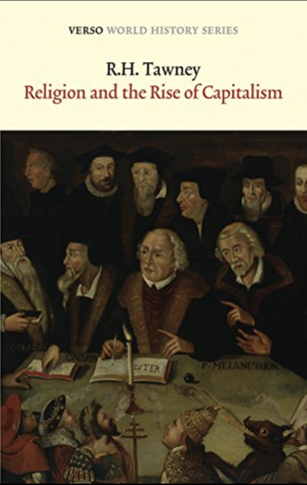

class: inverse, middle

```{r Setup, include = F}
options(htmltools.dir.version = FALSE)
library(pacman)
p_load(broom, latex2exp, ggplot2, ggthemes, ggforce, viridis, dplyr, magrittr, knitr, parallel, xaringanExtra, tidyverse, sjPlot, showtext, mathjaxr, ggforce, furrr, kableExtra, wooldridge, hrbrthemes, scales, ggeasy, patchwork, MetBrewer, readxl)


# Knitr options
opts_chunk$set(
  comment = "#>",
  fig.align = "center",
  fig.height = 7,
  fig.width = 10.5,
  warning = F,
  message = F,
  dpi=300
)

theme_set(theme_ipsum_rc())

```


# Motivation

---

# Motivation

<br>

Suppose you end up with a *flat tire* in the middle of Wisconsin while taking a road trip.


<br>

--
  - What is your .hi-orange[first] action? 


---

# Motivation

Since tasks we cannot do ourselves can be performed by others, the .hi[guaranteeing of the daily bread] is secured to a wide range of .hi-orange[economic agents].

--

<br>

  - *What/Who are these agents*?


  
--

  - Households;
  - Firms;
  - Government;
  - Law enforcement.
  
--

<br>

Therefore, the material abundance we know today is a product of the .hi[division of labor].


---

layout: false
class: inverse, middle

# The individual and society

---

# The individual and society

Over the course of economic progress, the .hi[division of labo]r has allowed economies to improve technology, productivity, and the well-being of society.

--

Along with this, so have improved the .hi-orange[reach of human wants].

--

  - And this progress comes at the expense, primarily, of .hi[nature].

--

Thus, .hi-orange[scarcity] is not only a feature of *nature*, but also created and intensified by *humans.*

<br>

--

The "*standard*" definition of Economics usually gravitates around the lines of

  > *Allocating scarce resources among finite ends*.
  
--

.right[*Do you agree*?]
  


---

# The individual and society

Regardless of the social system, .hi[any] economy must solve two .hi-orange[fundamental tasks] to function:

--

<br>

  1. .hi[Production];
  2. .hi[Distribution].
  
<br>
  
--

Regarding .hi[1], a society must provide enough goods and services to guarantee its survival.

--

And after output is produced, how to .hi-orange[arrange the circulation] of what is produced?

--

<br>

Although simple *intuitively*, in *practice* these two tasks are quite .hi[complicated].


---

# The individual and society

<br>

Most of the times, nature .hi[does not] give humans the *finished* products for their consumption.

--

Thus, some process(es) of .hi-orange[material transformation] is (are) necessary.

--

<br>

  - The process of .hi[production], therefore, involves *organizing the social institutions that will mobilize efforts to advance these material transformations*.
  
  

<br>

  - *What to produce?*
  - *How much to produce?*
  - *And produce to whom?*

---

# The individual and society


After these decisions are made, the problem becomes how to .hi[distribute] the fruits of human productive effort.

--

And the .hi-orange[strategy] to distribute output must keep individuals constantly engaged in production.


--

.mono[Q]: .hi[How] to *produce* and *distribute*?  

--

Throughout History, we have experiences .hi[three] main types of .hi-orange[solutions] to the production and distribution issues.

--


These are:

  1. *Tradition*;
  2. *Command*;
  3. *The market*.


---

layout: false
class: inverse, middle

# Solutions to the economic problem


---

# Solutions to the economic problem

Let us start with .hi[tradition].

--

Over a long process of trial and error, *tradition* is established as a mode of organization based on .hi-orange[custom] and .hi[belief].

--

Usually, tradition assigns .hi[production] tasks to fathers and sons.


--

And .hi-orange[kinship] regulates the .hi[distribution] process.

--

<br>

Tradition however, lacks .it[dynamism.]

  - Unable to produce in *larger scales*.
  
  
---

# Solutions to the economic problem

<br><br>

.hi[Command] is a method of .hi-orange[imposed authority].

--

<br>

In this setting, .hi[production] and .hi[distribution] occur according to .it[authoritarian] enforcement.


--

<br>

Here, progress can happen quite fast, given *power relations*. 

---

# Solutions to the economic problem

<br>

Lastly, the .hi[market] has no deep ties with either *tradition* or *command*.

--

<br>

How .hi[production] and .hi[distribution] are (dis)organized will depend on different points in time and locations.

--

<br>

And to better understand this puzzle we have to go back in History and see the main differences between .hi-orange[pre-market] and .hi[market] societies.


---
layout: false
class: inverse, middle

# Pre-market societies

---

# Pre-market societies

<br>

The act of .hi[trading] commodities is as *old* as humankind.

--

However, for most of human history, the .hi-orange[market] was an *accessory* of daily lives.

--

  - In other words, the processes of .hi[production] and .hi[distribution] were independent of "markets."
  


--

<br>

Let us further highlight some aspects of .hi-orange[Ancient] and .hi-orange[Medieval] societies.


---

# Pre-market societies

Throughout .hi[Antiquity], the predominant economic activity was .hi-orange[agriculture].

--

  - In terms of .hi[division of labor], not many individuals were "freed" from this activity.


--

The main economic agent was the .hi-orange[peasant].

  - Production mostly for subsistence;
  - Distribute a portion of it to the *owner* of the land.

--

No notion of .hi[profits] at all.

--

In urban settings, any trading activities usually involved *luxury* goods from abroad.

--

Furthermore, the main form of urban labor was .hi-orange[slavery].


--

Lastly, if any .hi[wealth] could be produced, it was not in the hands of *economic agents*.

  - *Political, military*, or *religious* status. 


---

# Pre-market societies

In .hi[Medieval] times&mdash;especially after the fall of the *Roman empire*&mdash;the .hi-orange[economic] aspect of antiquity was also strongly changed.

--


The basic economic organization, then, became the .hi[feudal] system.

--

The *manorial* estate was typically a large portion of land, owned by a feudal *lord*.


--

<br>

On the other hand, *serfs* were not slaves, but, in practice, a property of the lords.

  - Tied by their plots of land;
  
  - Performing labor for the lord.


---

# Pre-market societies

One of the most important aspects to the *lord*-*serf* relationship was the .hi[security] provided by the  former to the latter.

  - Physical;
  - Food.
  

--

<br>

Overall, in this very .hi-orange[static] system, the economic problems were *not* what dominated .hi[individual] behavior.

--

  - What was it, then?
  
--

  - Economic matters were imposed by the .hi[Catholic Church].


---

# Pre-market societies

A Catholic saying:

  > *"Homo mercator vix aut numquam Deo placere potest."*
  
  > *"The merchant can scarcely or never be pleasing to God."*

--

An *improvement of economic well-being* was seen with strong constraints by the Church.

--

<br>

Among several issues, some are worth mentioning:

  - The *"just" price*; 
  - *Usury.* 

---

# Pre-market societies

Given this brief historical background, what was then .it[necessary] to establish a .hi[market society]?

--

  - Economic *gain* must be accepted (profits);
  - The economy must be *monetized.* 
  - Monetized markets must be the center of gravity around which economic activity fluctuates.
      - That is where people can make money!
      
--


.pull-left[<br>Book recommendation: *"Religion and the rise of capitalism,"* by R. H. Tawney]

.pull-right[

]


---

layout: false
class: inverse, middle

# The emergence of markets


---

# The emergence of markets

What are some .hi[economic agents/events] that have led us to market societies?

  - Itinerant *merchants*; 
  
  - *Urbanization*; 
  
  - *Exploration*; 
  
  - Change in *religious* conventions.
  
    - Calvinism; 
    - Protestant ethic.
    
  - Rise of *cash.*


---

# The emergence of markets

<br>

All in all, market society can be boiled down to a few factors:

  - .hi[Self interest]/profit motive;
  
  - The establishment of labor, land, and capital as .hi-orange[factors of production].
  
--

<br><br>

With the factors allowing for market society to develop, we establish the .hi[capitalist economic system].


---

layout: false
class: inverse, middle

# Next time: Technology, population, and growth


---
exclude: true