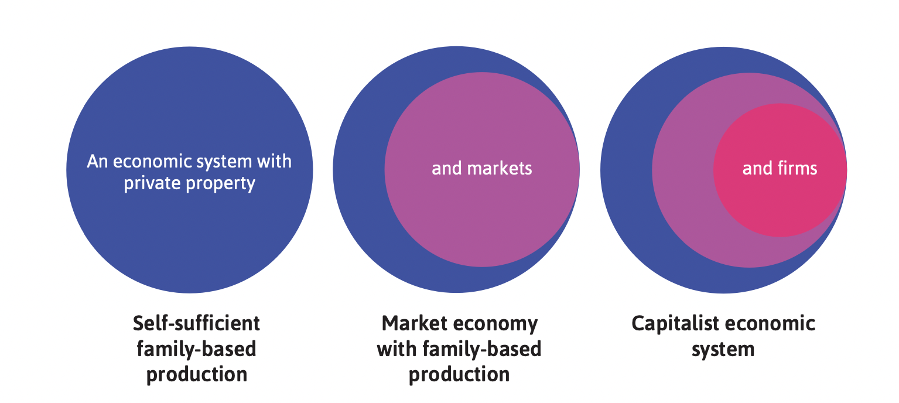
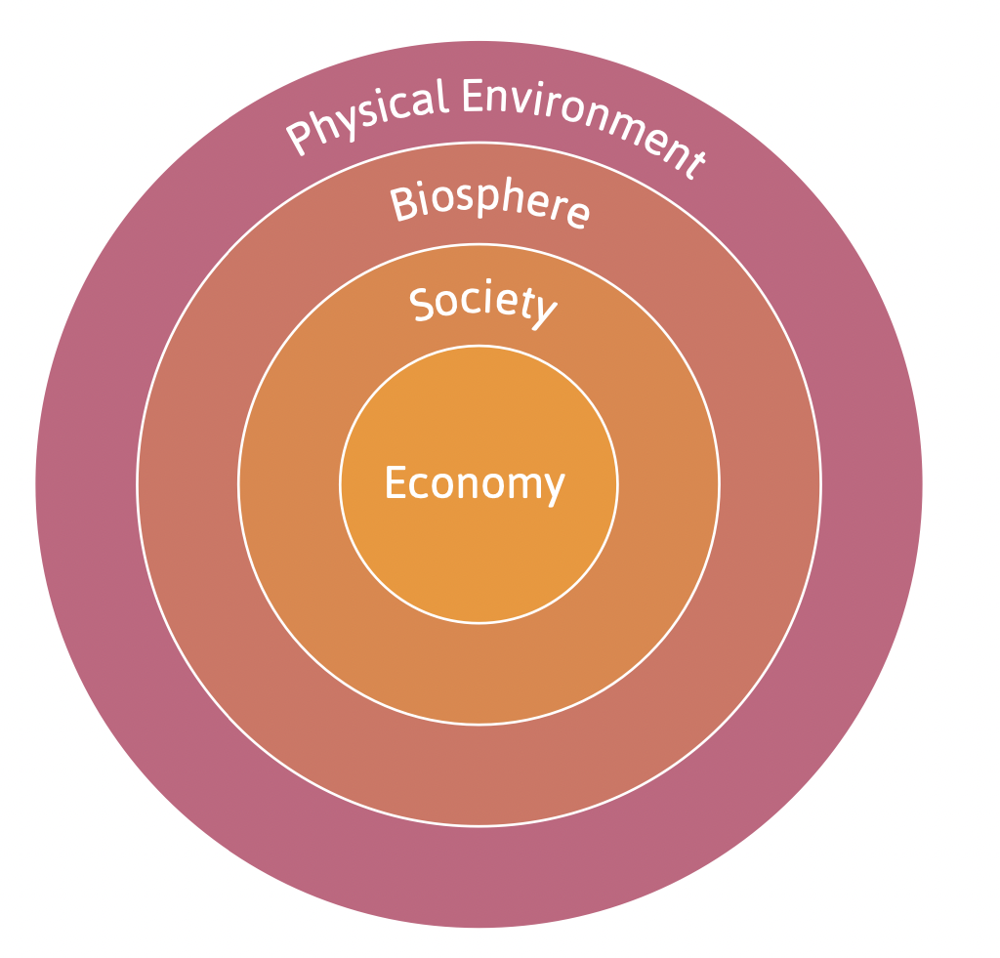

class: inverse, middle

```{r Setup, include = F}
options(htmltools.dir.version = FALSE)
library(pacman)
p_load(broom, latex2exp, ggplot2, ggthemes, ggforce, viridis, dplyr, magrittr, knitr, parallel, xaringanExtra, tidyverse, sjPlot, showtext, mathjaxr, ggforce, furrr, kableExtra, wooldridge, hrbrthemes, scales, ggeasy, patchwork, MetBrewer, readxl)


# Knitr options
opts_chunk$set(
  comment = "#>",
  fig.align = "center",
  fig.height = 7,
  fig.width = 10.5,
  warning = F,
  message = F,
  dpi=300
)

theme_set(theme_ipsum_rc())

```


# Motivation


---

# Housekeeping

<br>

* .b[Required reading]:

  * [`CORE, ch. 1`](https://www.core-econ.org/the-economy/book/text/01.html).
  
      * Introduction; Sections `1.6`, `1.7`, `1.10`, `1.12`.
  
<br>

* .b[Recommended reading]:

  * `Heilbroner & Milberg`, ch. 1.
  
      * Available on `theSpring` (see *Extra Readings* module).


---

layout: false
class: inverse, middle

# The big picture


---

# The big picture

<br>

How is a .hi[hockey stick] related to this course?

<br>


.pull-right[


]


---

# The big picture


```{r, dev = "svg", fig.height = 5.5, echo=FALSE, warning=FALSE}
dat <- read_xlsx("maddison.xlsx", sheet = 3)

dat_sample <- dat %>% 
  filter(country %in% c("United Kingdom", "China", "Japan", "India", "Italy")) %>% 
  filter(year >= 1000)

dat_sample %>% 
  ggplot(aes(x = year, y = gdppc, color = country)) +
  geom_line(size = 0.8) +
  scale_y_continuous(labels=scales::dollar_format()) +
  scale_color_met_d("Homer2") +
  labs(x = "", y = "GDP per capita", title = "Gross domestic product per capita, selected countries (1000-2018)") +
  easy_legend_at("bottom") +
  easy_remove_legend_title() +
  easy_plot_legend_size(13) +
  easy_y_axis_title_size(13)
```


---

# The big picture

It is clear that something happened after the 1800s to produce such an increase in GDP *per capita*.

--

<br>

And with this, a few .hi-orange[remarkable] facts:


  * Increasing *living standards*;
  * Rapid *technological progress*;
  * Higher degree/pace of *social mobility*;
  * *Globalization.*
  


--

<br>

.right[
But what .hi[*exactly*] has happened since this period?
]  


---

layout: false
class: inverse, middle

# What has led us here?


---

# What has led us here?


This can be boiled down to the advent of .hi[capitalism].

--

  * We all know what the term *capitalism* means, but we will qualify this term better for our purposes.
  
--

<br>

And .hi-orange[what] purpose is that?

--

  * To think in .hi[economic] terms.
  
--

<br>

> Studying economics is studying how *society provides for its material well-being*.

--

<br>

And in providing for such material needs, individuals interact with .hi-orange[each other] and the .hi[natural environment].


---


# What has led us here?

In doing so, to better understand how the macroeconomy operates, we must understand *capitalism* as a .hi[social system].

--

As such, it has particular

  * historical origins;
  * unprecedented features and institutions.
  
--

We will study its *historical origins* in greater detail next time.

--

The .hi[capitalist social system] combines three main .hi-orange[institutions]:

  1. Private propery;
  2. Markets;
  3. Firms.
  
--

And the .hi[way] in which these three are combine will *vary* across countries and over distinct time periods.

---

layout: false
class: inverse, middle

# Defining capitalism


---

# Defining capitalism

Differently from the *state* or other institutions owning the *means of production*, in capitalism most productive forces are .hi-orange[individually owned].

--

One of the most important types of private property are .hi[capital goods]:

  - Buildings;
  - Machinery;
  - Software and other equipment.
  
--

Anything that can be enjoyed in a way chosen by the owner, that *excludes* other people from its use, and can be either *given* or *sold* to a third party can be defined as .hi[private property].

--

 
Of course, private capital goods .hi-orange[do not] include what we can *freely* obtain from nature:

  - Water;
  - Air.
  
---

# Defining capitalism


.hi[Markets] are a means of transferring goods or services from one person to another. 

--

<br>

Some .hi-orange[distinctive features] of markets are the following:

  1. Exchanges are *reciprocated* (transfer occurs in both directions, through barter, money, and/or credit);
  
  2. Buyers and sellers engage in exchange relations *voluntarily*;
  
  3. There is some degree of *competition.*

---

# Defining capitalism

<br>

Lastly, production is organized mostly through .hi[firms].


--

Some .hi-orange[key features] of capitalist firms:

  - Usually, one or more individuals .hi-orange[own] a set of capital goods that are used in production;
  
  - They have employees, who receive .hi[wages] in exchange for their labor time;
  
  - What the firm produces (its .hi-orange[output]) is property of its owner(s);
  
  - This output is sold in the market for a price, with the ultimate goal of generating .hi[profits].
  

---

# Defining capitalism

In a figure...

<br>

.center[

]


---

layout: false
class: inverse, middle

# The other side


---


# The other side

<br>


Back to the core economic problem&mdash;*guaranteeing our daily bread*&mdash;such task is totally dependent on .hi[nature].

--

<br>

The .hi-orange[essential resources] humans need for their lives are extracted from the *surrounding environment* and the *biosphere.*


  - Air;
  - Water;
  - Food.
  
---

# The other side

The economy is an important aspect of life and of society, but it is part of a .hi-orange[larger social system]:

.center[

]

---

# The other side


<br><br>

Only recently have we regarded natural resources and the environment as limited in .hi[quantity] and .hi[quality].

--

<br>

For the "hockey stick" to take place, the whole .hi-orange[ecological system] has gone through profound degradation and change.


---

# The other side


```{r, dev = "svg", fig.height = 5.5, echo=FALSE, warning=FALSE}
co2 <- read_csv("co2.csv")


co2 %>% 
  filter(country %in% c("United Kingdom", "United States", "China", "Brazil")) %>% 
  ggplot(aes(x = year, y = co2_per_capita, color = country)) +
  geom_line(size = .8, alpha = 0.6) +
  easy_legend_at(to = "bottom") +
  labs(x = "", y = "Emissions per capita", title = "Carbon emissions per capita, 1800-2020") +
  easy_remove_legend_title() +
  easy_y_axis_title_size(13) +
  easy_plot_legend_size(13) +
  scale_color_met_d("Degas")

```


---

layout: false
class: inverse, middle

# Next time: Pre- and market societies


---
exclude: true