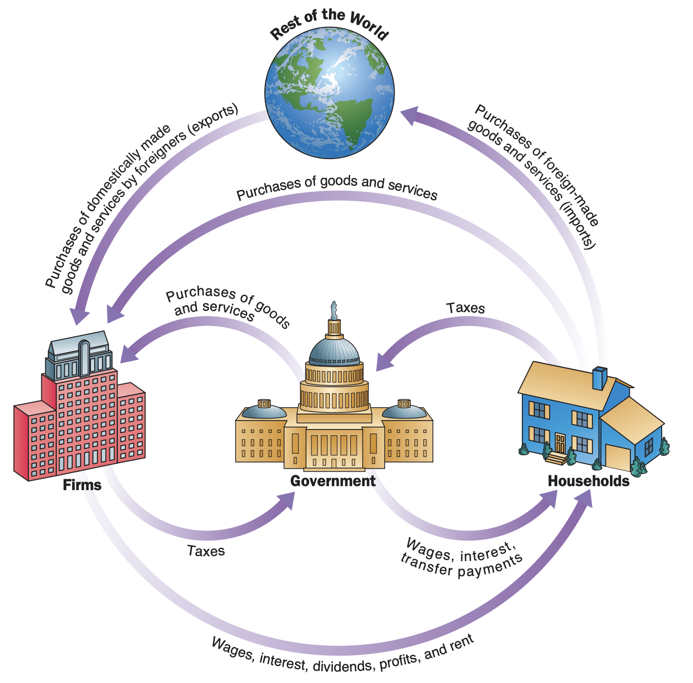

class: inverse, middle

```{r Setup, include = F}
options(htmltools.dir.version = FALSE)
library(pacman)
p_load(broom, latex2exp, ggplot2, ggthemes, ggforce, viridis, dplyr, magrittr, knitr, parallel, xaringanExtra, tidyverse, sjPlot, showtext, mathjaxr, ggforce, furrr, kableExtra, wooldridge, hrbrthemes, scales, ggeasy, patchwork)


# Knitr options
opts_chunk$set(
  comment = "#>",
  fig.align = "center",
  fig.height = 7,
  fig.width = 10.5,
  warning = F,
  message = F,
  dpi=300
)

theme_set(theme_ipsum_rc())

```


# Motivation


---

# Housekeeping

 .b[Required readings]:
 
 <br>

  * [`CORE, ch. 13`](https://www.core-econ.org/the-economy/book/text/13.html)
  
      * Sections `13.3` & `13.4`
    
<br>

  * [`OpenStax, ch. 6`](https://openstax.org/books/principles-macroeconomics-2e/pages/6-introduction-to-the-macroeconomic-perspective).


---

# Last time

<br>

After a brief overview of what defines the .hi[capitalist] social system, we will focus on how this system works as a .hi-orange[whole].

--

In case one is interested in the economic functioning of the entire system, it requires studying .hi[Macroeconomics].

--

  - Macroeconomics focuses on the .hi-orange[determinants] of total *national* output (i.e., its *goods* and *services*).


--

<br>

Thus we .hi[do not] focus on *household* income, but *national* income; not individual prices, but the *whole economy's* price level, and so on.


---
layout: false
class: inverse, middle

# The size of the economy


---

# The size of the economy


<br><br><br>

[`What is the size of the US economy?`](https://fred.stlouisfed.org/series/GDPC1)


---

# The size of the economy

Economists use .hi-orange[aggregate statistics] to describe macroeconomic phenomena.

  - Here, *aggregate* simply means .hi[sum].


--

<br>

Among these, the .hi[Gross Domestic Product] (GDP) is the leading measure of a country's overall economic *performance* and *size.*

--

  * It is the sum (in money value) of all .hi-orange[final] goods and services produced in an economy in a given year. As described by the economist Diane Coyle:


> .small[*"Everything from nails to toothbrushes, tractors, shoes, haircuts, management consultancy, street cleaning, yoga teaching, plates, bandages, books, and the millions of other services and products in the economy."*]

---
layout: false
class: inverse, middle

# Key macroeconomic problems


---

# Key macroeconomic problems

Macroeconomic problems and concerns are diverse, but may be summmarized by .hi[three] major issues:

  1. .hi[Output growth];
  
  2. .hi[Unemployment];
  
  3. .hi[Inflation].
  
--

<br>

Every economic policy maker will state that their goals are .hi[high output growth], .hi-orange[low unemployment], and .hi[low inflation] (or stable prices).

--

<br>

.right[...But are these *feasible* altogether?]


---

# Key macroeconomic problems


On average, economies tend to .hi[rise] over time.

--

However, this process has its short-run  *ups* and *downs*..smallest[.footnote[Picture taken from Case, Fair, and Oster (2012).]]

--

.center[

]


---

# Key macroeconomic problems

.pull-left[ <br>

]

.small[.pull-right[
* These periods of *ups* and *downs* experienced by a national economy are known as .hi[business cycles.]

* The highest point of the business cycle is known as the .hi-orange[peak].

* The lowest, the .hi[trough].

* An economic .hi-orange[expansion] is the period from a *trough* to a *peak*.

* And from *peak* to *trough* we have economic .hi[recessions].

* Most business cycles are not .hi-orange[symmetrical].
]]


---

# Key macroeconomic problems

<br><br><br>

[`US National Bureau of Economic Research (NBER) business cycle information`](https://www.nber.org/research/data/us-business-cycle-expansions-and-contractions)


---

# Key macroeconomic problems

<br><br><br>

Over the long-run trajectory of economic growth, business cycles produce different .hi[unemployment] and .hi-orange[inflationary] contexts.

--

<br>

All of these issues will be further investigated in the *following weeks*.


---
layout: false
class: inverse, middle

# The components of the macroeconomy

---

# The components of the macroeconomy

<br><br>

From an aggregate perspective, the .hi[participants] of an economy can be grouped in 4:

  1. *Households*;
  2. *Firms*;
  3. The *government*;
  4. The *rest of the world*.
  
--

<br>

Households and firms form the .hi-orange[private sector], while the government is the .hi[public sector], and the rest of the world is the .hi-orange[foreign sector].

---

# The components of the macroeconomy

.smaller[The economic interactions involving these 4 groups can be summarized through the .hi[circular flow diagram]:].footnote[.smaller[Picture taken from Case, Fair, and Oster (2012).]]

.center[

]

---

# The components of the macroeconomy

<br><br>

If we analyze GDP from the perspective of .hi[spending], it can be broken down into the following components:

<br>

* .hi[*Consumption*] of goods and services;

* Private .hi[*investment*];

* .hi[*Government*] expenditures;

* .hi[*Net exports*] (*Exports* - *Imports*).


---

# The components of the macroeconomy

<br>

.hi[Consumption] accounts for all household consumption expenditures on final goods and services.

  - Household appliances, haircuts, concert tickets, groceries,...

--


<br>

It usually accounts for about 2/3 of total GDP.

--

<br>

[`US aggregate consumption data`](https://fred.stlouisfed.org/series/PCE)

---

# The components of the macroeconomy

<br>

Aggregate .hi[investment] accounts for businesses purchasing new machinery, new software, new plants, as well as household residential investment.

  - It also includes *inventories*, which is unsold output produced in the reference year.
  

--

<br>

[`US aggregate private investment data`](https://fred.stlouisfed.org/series/GPDI)


---

# The components of the macroeconomy

<br>

.hi[Government] expenditures account for federal, state, and local instances consumption and investment decisions.

  - Building highways, new schools, military spending, health & education,...

  - Unemployment and veteran benefits, social security payments are .hi[not] included. These are transfers that will likely be spent on *consumption.*
  
--

<br>

[`US aggregate government expenditures data`](https://fred.stlouisfed.org/series/FGEXPND)

---

# The components of the macroeconomy

<br>

.hi[Net exports] is the difference between .hi-orange[exports]&mdash;domestically produced goods that a country sells abroad&mdash;and .hi-orange[imports]&mdash;goods and services produced in other countries that residents of another country purchase. 


  * We call the gap between exports and imports the .hi[trade balance]. If a country’s exports are larger than its imports, then a country has a .hi-orange[trade surplus]; if imports exceed exports, we have a .hi[trade deficit].

--

<br>

[`US net exports data`](https://fred.stlouisfed.org/series/NETEXP)

---

# The components of the macroeconomy

We can now write down the GDP measurement as:

<br>

$$
\begin{aligned}
\text{GDP} = \text{Consumption + Investment + Government Spending + Net exports}
\end{aligned}
$$

<br>

$$
\begin{aligned}
\text{GDP} = C + I + G + (X - M)
\end{aligned}
$$

---

# The components of the macroeconomy

<br><br>

> [`NIPA tables by the Bureau of Economic Analysis (BEA)`](https://apps.bea.gov/iTable/iTable.cfm?reqid=19&step=2#reqid=19&step=2&isuri=1&1921=survey)


---

 


---

# The size of the economy

One caution when computing GDP is to avoid .hi[double counting].

--

Counting output more than once is a statistical .hi-orange[mistake], and may overstate the size of an economy.

--

<br>

For instance, suppose a farmer sells oats to a miller by $50. The miller, then, refines it and produces oat flour. A bakery's owner purchases this oat flour by $100. This bakery sells oat cakes adding up to $200 per week. 

--

.right[
Which of these values goes into GDP accounting?
]

--

<br>

.hi[Intermediate, illegal], and .hi[used] goods, as well as .hi[transfer payments] are .hi-orange[not] accounted for in GDP.

---

layout: false
class: inverse, middle

# Real vs. nominal GDP


---

# Real vs. nominal GDP

A .hi[crucial] distinction in Economics is between .hi-orange[real] and .hi-orange[nominal] values.

--

For the case of GDP, this is especially important when .hi[inflation] is such an important component of the economy.

--

> .hi-orange[Inflation] is a *sustained* increase in sn economy's price level.

--

<br>

The .hi[nominal] value of any economic measure means implies a statistic in terms of .hi-orange[actual prices] that exist at the time.

--

On the other hand, .hi[real] values refer to the *same* statistic after it has been .hi-orange[adjusted for inflation].


---

# Real vs. nominal GDP

Simply looking at *nominal* values when evaluating economic statistics may be misleading.

--

Consider the number of cars sold, for instance.

--

  * Does an SUV have the *same* prce today, relative to 1985?
  
--

<br>


Thus, to have a more *accurate* basis for evaluating economic growth, economists prefer .hi[real] measures, as they account for inflation.

--

For the case of GDP, we use the .hi-orange[GDP deflator] to .hi[*normalize*] nominal GDP values.

--


> The .hi[GDP deflator] is a price index measuring the average prices of all final goods and services included in the economy.

---

# Real vs. nominal GDP

[put table 6.5]


calculate real gdp from it.

$$
\begin{aligned}
\text{Real GDP} = \dfrac{\text{Nominal GDP}}{\text{GDP Deflator}}
\end{aligned}
$$

---

# Real vs. nominal GDP

[And a plot comparing the two]


---
layout: false
class: inverse, middle

# GDP over time


---

# GDP over time


[first grapha again]


---

# GDP over time

A .hi[recession] happens whenever significant short-term declines interrupt a general upward long-term trend of GDP.

--

In cases of *lenghty* and *deep* recessions, the economy experiences a .hi-orange[depression].


<br>

.right[
Do you recall any *examples* of depressions and/or recessions?
]


--

An economy's movement from peak to trough and trough to peak the .hi[business cycle].

---
layout: false
class: inverse, middle

# Same measure, different countries


---

# Same measure, different countries

How do we know if an economy is doing well?

--

One way to go about it is to compare itsv economic perfomance with previous years.

--

However, comparing economic performance .hi[among different countries] is a powerful tool for economists, especially in periods of expansions and recessions.

--

Recall the concept of .hi-orange[Nominal] GDP.

  * Given that we do not have a uniform currency around the globe, how do we compare the .hi[*same*] statistic (GDP) for countries with .hi[*different*] currencies (e.g., dollar, euro, yen, peso, etc.)?
  
--

Using an .hi[exchange rate]&mdash;the value of one currency in terms of *another* currency, is a way to compare the same economic measure across different countries.


---

# Same measure, different countries

One of the main common denominators for comparing different countries are .hi[purchasing power parity] (PPP) equivalent exchange rates. 

--

Suppose country *A*'s GDP in 2020 was $2.0 trillion, while country *B*'s was $5 trilion.

--

Country *A*'s currency is called *z*, while country *B*'s currency is *y*.

--

How much is country *A*'s GDP *in terms of* country *B*'s currency?

--

Given that 1.70 *z* = 1 *y*, we have


$$
\begin{aligned}
\text{A's GDP in y units} = \dfrac{\text{A's Nominal GDP}}{\text{Exchange rate (z/y)}}
\end{aligned}
$$

--

$$
\begin{aligned}
\text{A's GDP in y units} = \dfrac{2.0}{1.70} = 1.176 \ \text{trillion}
\end{aligned}
$$

---

# Same measure, different countries

What about countries with different .hi[population sizes]?


--

The simplest way to evaluate a country's GDP taking into account its population size is to compute teh GDP *per capita*.

<br>

$$
\begin{aligned}
\text{GDP per capita} = \dfrac{\text{GDP}}{\text{Population size}}
\end{aligned}
$$


---
layout: false
class: inverse, middle

# GDP vs. well-being

---

# GDP vs. well-being

<br>

Do you believe that a country's GDP *accurately* measures how well its population is?

--

<br>


[now more conditions to evaluate whether gdp implies higher living standards -- had this discussion in the first week.]


---

# GDP vs. well-being


Moral of the story: no measure is perfect. we have to be critical about it and evaluate them alongside other measures, according to our interests.

---
layout: false
class: inverse, middle

# Next time: Economic growth


---
exclude: true