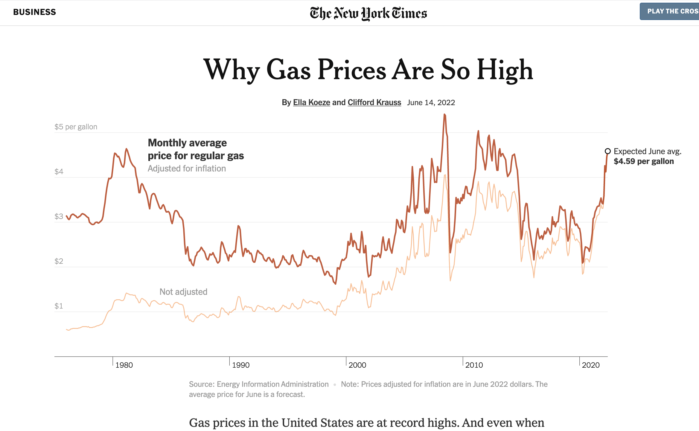
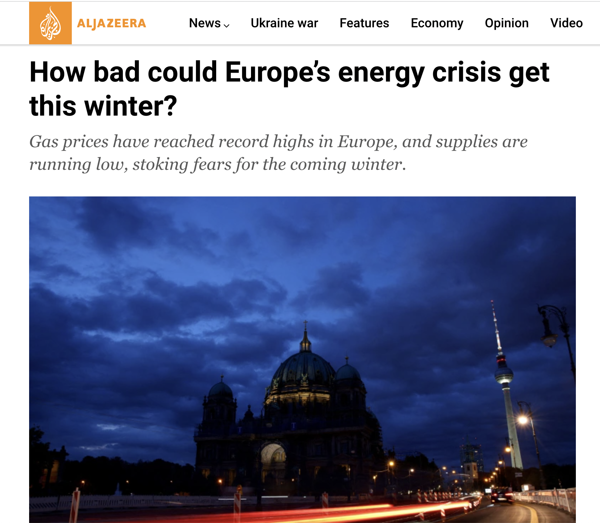
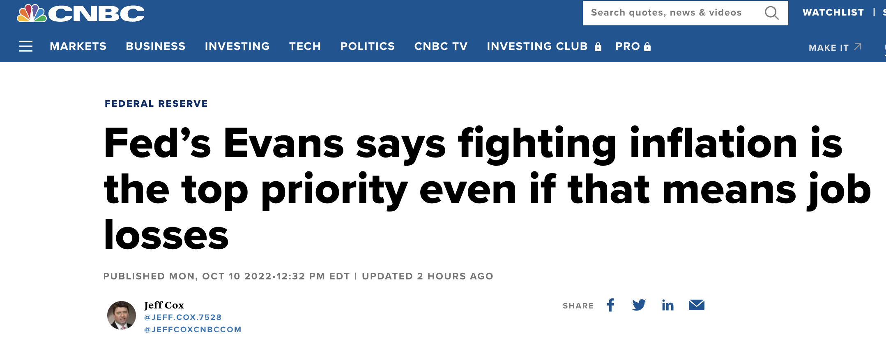

class: inverse, middle

```{r Setup, include = F}
options(htmltools.dir.version = FALSE)
library(pacman)
p_load(broom, latex2exp, ggplot2, ggthemes, ggforce, viridis, dplyr, magrittr, knitr, parallel, xaringanExtra, tidyverse, sjPlot, showtext, mathjaxr, ggforce, furrr, kableExtra, wooldridge, hrbrthemes, scales, ggeasy, patchwork)


# Knitr options
opts_chunk$set(
  comment = "#>",
  fig.align = "center",
  fig.height = 7,
  fig.width = 10.5,
  warning = F,
  message = F,
  dpi=300
)

theme_set(theme_ipsum_rc())

```


# Motivation


---

# Housekeeping

<br>

* .b[Required reading]:

  * [`CORE, ch. 13, section 13.8`](https://www.core-econ.org/the-economy/book/text/13.html#138-measuring-the-economy-inflation).
  
  * [`Consumer Price Index: Frequently Asked Questions`](https://www.bls.gov/cpi/questions-and-answers.htm)

---

# What is going on?


<br><br>

[`The recent numbers`](https://fred.stlouisfed.org/series/CPIAUCSL)


---

# What is going on?

.center[



]

---


# What is going on?

<br><br>

[`What if we exclude food and energy prices?`](https://fred.stlouisfed.org/series/CPILFESL)


---

layout: false
class: inverse, middle

# Defining inflation


---

# Defining inflation

In .hi[market economies], prices of individual goods *continually* change, as .hi-orange[consumption] and .hi-orange[production] patterns vary over time.

--

In .hi[Microeconomics], one major concern is how .hi-orange[relative] prices change over time.

  - For example, why have *internet services* become less expensive over time, while *healthcare* more expensive?
  
--

<br>

.hi-orange[Macroeconomics], on the other hand, is more interested in the .hi[overall] price level of goods and services over time.

--

The prices of the almost *uncountable* number of goods and services we consume .hi-orange[do not] rise and fall at the same rates, so measuring inflation is a *challenging* task.


---

# Defining inflation


.hi[Inflation] is a *general*, *steady* increase in prices.

--

<br>

  * But .hi-orange[what] prices?
  
--
  
    * Most prices!
    
--

    * But what prices?
  
--

<br>

  * Prices of a fixed .hi[basket of goods and services] that represents the purchases of the average family of *consumer unit*.
  
--

Every few years, the mix of goods and services in this basket is updated.

---

# Defining inflation

```{r, echo=F, cache=TRUE, dev = "svg", fig.height=5.5}

cex <- tibble(
  "Shelter" = 32.39 + 3.77 + 0.90,
  "Food" = 13.99 + 0.99,
  "Transportation" = 7.98 + 5.05,
  "Energy" = 7.54,
  "Medical care" = 6.99 + 1.49,
  "Education and Communication" = 6.01 + 0.47,
  "Apparel" = 2.67,
  "Recreation"= 3.67 + 1.95,
  "Other goods and services" = 1.07 + 1.63 + 1.45
)


cex <- cex %>% 
  pivot_longer(cols = Shelter:`Other goods and services`,
               names_to = "components",
               values_to = "share")

cex %>% 
  mutate(components = fct_reorder(components, share)) %>% 
  ggplot(aes(x = share, y = components)) +
  geom_col(alpha = 0.7) +
  scale_x_continuous(labels = percent_format(scale = 1),
                     breaks = seq(5, 50, 5)) +
  labs(y = "",
       x = "",
       title = "Consumer Price Index: Basket of goods",
       subtitle = "% share (November 2021)",
       caption = "Source: US Bureau of Labor Statistics")
```


---

# Defining inflation

Inflation is a .hi[real] phenomenon.

--

  * It is .hi[real] because it .hi-orange[deteriorates] the *purchasing power* of money.

--

  * If one's monthly .hi[income] was $4,000 is one thing in 2019, how is this person in 2022?


--

<br>

Thus, if income .hi[does not] compensate for a general increase in the prices of goods and services, (almost) everyone is worse off in an inflationary scenario.

--

Cases to think about:

  - *Fixed* incomes;
  - *Indexed* benefits/contracts;

---

layout: false
class: inverse, middle

# Measures of inflation


---

# Measures of inflation

Depending on what goods and services considered&mdash;and their respective *weights*&mdash;an inflation index will be different.

--

<br>

In the US economy, we have a few relevant .hi[measures of inflation]:

<br>

.b[1]. The Consumer Price Index (CPI);

.b[2]. The CPI's *Core* Index;

.b[3]. The Personal Consumption Expenditure deflator (PCE);

.b[4]. The GDP deflator.


---

# Measures of inflation

The most popular measure of inflation in the US is the .hi[Consumer Price Index] (CPI).

--

The basket of goods and services it uses is based on .hi-orange[urban] households.

--

<br>

The US Bureau of Labor Statistics (BLS) calculates the CPI, through the Consumer Expenditure Survey (CE).

  * Consumer expenditures are divided into 8 groups, including *food and beverages*, *housing*, *apparel*, *transportation*, *medical care*, *recreation*, *education and communication*, and *other goods and services* (including tobacco, personal services, etc.)
  
  
---

# Measures of inflation

```{r, echo=F, cache=TRUE, dev = "svg", fig.height=5.5}

cex <- tibble(
  "Shelter" = 32.39 + 3.77 + 0.90,
  "Food" = 13.99 + 0.99,
  "Transportation" = 7.98 + 5.05,
  "Energy" = 7.54,
  "Medical care" = 6.99 + 1.49,
  "Education and Communication" = 6.01 + 0.47,
  "Apparel" = 2.67,
  "Recreation"= 3.67 + 1.95,
  "Other goods and services" = 1.07 + 1.63 + 1.45
)


cex <- cex %>% 
  pivot_longer(cols = Shelter:`Other goods and services`,
               names_to = "components",
               values_to = "share")

cex %>% 
  mutate(components = fct_reorder(components, share)) %>% 
  ggplot(aes(x = share, y = components)) +
  geom_col(alpha = 0.7) +
  scale_x_continuous(labels = percent_format(scale = 1),
                     breaks = seq(5, 50, 5)) +
  labs(y = "",
       x = "",
       title = "Consumer Price Index: Basket of goods",
       subtitle = "% share (November 2021)",
       caption = "Source: US Bureau of Labor Statistics")
```
  
---

# Measures of inflation

> *"The Consumer Expenditure Surveys (CE) collect information from the Nation's households and families on their buying habits (expenditures), income, and household characteristics. The strength of the surveys is that it allows data users to relate the expenditures and income of consumers to the characteristics of those consumers. The surveys consist of two components, a quarterly Interview Survey and a weekly Diary Survey, each with its own questionnaire and sample."*

.right[[`Consumer Expenditure Surveys FAQ page`](https://www.bls.gov/cex/csxfaqs.htm)]

--

<br>

- Each consumer unit (i.e., household) is interviewed every *3* months over four calendar quarters.

- There are .hi[*two*] surveys to track different purchasing habits:

  - 3 months and longer (majorly *durable* goods and *regular* expenditures);
  - two consecutive 1-week periods (frequently purchased *smaller* items).
  

  

---

# Measures of inflation

<br>

The CPI's *Core* Index excludes .hi[food] and .hi[energy] prices, which tend to be the most .hi-orange[volatile] components of the CPI measure.

<br>

--

> “It provide(s) a better guide to monetary policy than the other indices, since it measures the more persistent underlying inflation rather than .hi[transitory] influences on the price level.”

.right[Ben Bernanke, former chair of the FED.]


---

# Measures of inflation

<br>

The .hi[Personal Consumption Expenditure deflator] (PCE), measured by the Bureau of Economic Analysis (BEA), is an alternative inflation measure in which the basket of goods and services is based on sales reported by .hi-orange[businesses].

--

  * It also accounts for purchases on households made by .hi-orange[third parties], such as *medical bills* paid by public and private insurance.
  
  * The CPI only includes expenditures made *directly* by households.
  


---

# Measures of inflation

<br>

Lastly, the .hi[GDP deflator] includes .hi-orange[investment] goods purchased by businesses, and does not include any imported goods.


--

  - Recall from a few lectures ago that this measure is used to convert .hi-orange[nominal] into .hi[real] GDP.
  
---
# Measures of inflation

```{r, echo=F, cache=TRUE, dev = "svg", fig.height=5.5}

inf <- read_csv("inflation_data.csv")

period <- seq(as.Date("1958/01/01"), by = "quarter", length.out = 258)

colors = c("CPI" = "#0057e7", "CPI Core index" = "#d62d20", "PCE" = "#232b2b")

inf %>% 
  add_column(period) %>% 
  ggplot(aes(x = period)) +
  geom_line(aes(y = pce, color = "PCE"), size = 1, alpha = 0.6) +
  geom_point(aes(y = pce, color = "PCE"), size = 1, alpha = 0.6) +
  geom_line(aes(y = cpi_core, color = "CPI Core index"), size = 1, alpha = 0.6) +
  geom_point(aes(y = cpi_core, color = "CPI Core index"), size = 1, alpha = 0.6) +
  geom_line(aes(y = cpi, color = "CPI"), size = 1, alpha = 0.6) +
  geom_point(aes(y = cpi, color = "CPI"), size = 1, alpha = 0.6) +
  scale_color_manual(values = colors) +
  geom_hline(yintercept = 0, lty = 2, alpha = 0.4) +
  scale_x_yearquarter() +
  labs(x = "",
       y = "% change from a year ago",
       title = "Three different inflation measures",
       subtitle = "US: 1958 Q1 - 2022 Q2",
       caption = "Source: US FRED") +
  easy_add_legend_title("Measure") +
  easy_y_axis_title_size(13) +
  easy_plot_legend_size(12)
  
```
---

# Measures of inflation

<br>

While all measures of inflation are .hi[useful], none of them can be considered a "true" account of it.

--

<br>

Furthermore, how do we track the .hi-orange[same] goods over time?

  * Think about *computers* or *phones* 20 years ago and today.

---

layout: false
class: inverse, middle

# Causes of inflation


---

# Causes of inflation

<br>

A steady increase in the overall price level of an economy may generally come from .hi[two] main sources:

--

<br>

  .b[1]. Demand;
  
  .b[2]. Supply.
  
--

<br>

When the root of inflation lies in .hi[consumer] behavior, it is said to be .hi-orange[demand-pull].

--

On the other hand, when it is related to what happens at the .hi[firm] level, inflation is said to be .hi-orange[cost-push].


---

# Causes of inflation

.hi[Demand-pull] inflation happens when there is an increasing demand for goods and services.

--

  - As it may take time to adjust production to accommodate this new behavior, the limited amount of certain goods and services becomes more valuable.
  
  - *"Too many dollars chasing too few goods."*
  
--

<br>

Some .hi[causes] for this behavior may include:

  - More-than-proportional real wage increases;
  
  - Government policies;
  
  - Lowering interest rates (higher access to credit).


---

# Causes of inflation

<br>

.hi-orange[Cost-push] inflation arises when it becomes more costly to produce certain goods and services.

  - Some of these costs can have widespread effects (e.g., oil and natural gas).
  
  - Wage negotiations disfavoring business owners.

  
--

<br>

Considering a stable demand scenario, increased production costs will be transmitted to the final prices consumers pay for goods and services.


---

# Causes of inflation

.center[



]


---

# Causes of inflation

<br>

.center[



]


---

layout: false
class: inverse, middle

# Next time: Inflation *vs*. unemployment


---
exclude: true