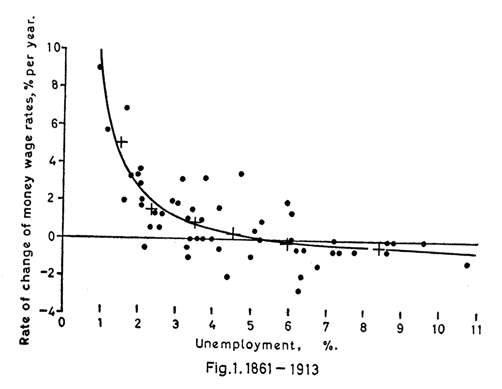

class: inverse, middle

```{r Setup, include = F}
options(htmltools.dir.version = FALSE)
library(pacman)
p_load(broom, latex2exp, ggplot2, ggthemes, ggforce, viridis, dplyr, magrittr, knitr, parallel, xaringanExtra, tidyverse, sjPlot, showtext, mathjaxr, ggforce, furrr, kableExtra, wooldridge, hrbrthemes, scales, ggeasy, patchwork,
       ggrepel)


# Knitr options
opts_chunk$set(
  comment = "#>",
  fig.align = "center",
  fig.height = 7,
  fig.width = 10.5,
  warning = F,
  message = F,
  dpi=300
)

theme_set(theme_ipsum_rc())

```


# Motivation


---

# Housekeeping

<br>

* .b[Required reading]:

  * [`A Warning for the World Economy: The worst is yet to come (NYT)`](https://archive.ph/20221012063646/https://www.nytimes.com/2022/10/11/business/imf-world-economy-forecast.html)
  
  * [`The Fed Wants to Quash Inflation. But Can It Do It More Gently? (NYT)`](https://archive.ph/20221006193257/https://www.nytimes.com/2022/10/06/business/economy/fed-mary-daly-interview.html)
  
  
  
  

---

# A trade-off

When thinking about *policy priorities*, economists (and the general population) usually .hi-orange[agree] on the following:

  * .hi[Low unemployment] and .hi[low (or stable) inflation] are desirable.
  
--

  * However, the .hi-orange[bitter truth] is that, usually, when unemployment is *low*, inflation tends to *rise.*
  
    - Why?
  
  * And when unemployment is *high*, inflation tends to *fall.*

--

Therefore, experiencing a .hi-orange[sustainable] scenario with both variables at low rates is almost impossible.

--

<br>

Then, we face a .hi[trade-off]:

  * How to balance people's jobs and the price level?


---

# A trade-off

This issue is of special importance during .hi[election] times.

--

How the economy is going&mdash;and this has a lot to do with *unemployment* and *inflation*&mdash;may define (re-)election results.

  * This resonates directly with the general public, who feels the effect of both variables in their .hi-orange[daily lives].
  
--

<br>

That said, how to find the .hi[balance] between unemployment and inflation?

--

<br>

The usual belief within economic policy is that .hi-orange[a little bit of inflation] *does not hurt*.

  * As long as it remains .hi[stable]!

---

layout: false
class: inverse, middle

# Inflation *vs.* unemployment

---

# Inflation *vs.* unemployment

In a dynamic economy, increases in .hi[nominal] wages may mask a fall in .hi-orange[real] incomes, when inflation is low and/or stable.

--

However, a .hi[reduction] in nominal wages, on the other hand, will never go unnoticed.

--

<br>

But how does this process *actually* unfold?

<br>

We will study this through a .hi[conflicting claims] approach.

--

First, let us assume an economy with:

  * Several small to medium-sized firms;
  
  * And their employees (ignoring Government, for the time being).
  
---


# Inflation *vs.* unemployment

The firms .hi[set] their market prices based on .hi-orange[costs], plus a .hi[markup] consistent with them making profits.

--

At the same time, firms try to pay *nominal wages* consistent with their targeted profits, but enough to keep workers *motivated.*

  * Moreover, workers .hi-orange[negotiate] each year their target wages.
  
--

<br>

The more .hi-orange[market power] a firm has, the more it can charge for its goods and/or services.

  * Resulting in a .hi[decreasing] real wage!
  
--

And the more organized workers are (via unions and other labor market institutions and policies), the more they can .hi[bargain] for better nominal wages (and consequently, better real wages).

---

# Inflation *vs.* unemployment

So can we say that .hi[higher employment] will lead to .hi-orange[higher inflation]?

--

In 1958, A. W. Phillips (1914&mdash;1975) .hi-orange[empirically] found that low rates of unemployment were associated with high rates of inflation, and high unemployment with low inflation. 

.right[]

--

This relationship has since been referred to as the .hi[Phillips curve].

---

# Inflation *vs.* unemployment

[`Link to original paper`](http://pombo.free.fr/phillips1958.pdf)

.center[



]

---

# Inflation *vs.* unemployment

.hi[How much] additional inflation one gets for a one point acceleration in GDP growth, or a one point fall in unemployment, depends on 

  * The .hi-orange[current values] of the variables;
  
  * On the country's .hi[historical] period;
  
  * And .hi-orange[how long] that period is.
  
<br>


--

Let us now evaluate the .hi[behavior] of the Phillips curve for the US economy over time.


---

# Inflation *vs.* unemployment


```{r, echo=FALSE, message=FALSE, warning=FALSE}
data <- read_csv('data_set.csv')


red_pink <- "#e64173"
met_slate <- "#23373b"
grey_mid <- "grey50"
red <- "#E02C05"
turquoise <- "#20B2AA"


##== Split data into three periods: 1948-1970, 1970-2000, and 2000-2020:


data_filter1 <- data %>% filter(DATE <= 1970)

data_filter2 <- data %>% filter(DATE >= 1970 & DATE <= 2000)

data_filter3 <- data %>% filter(DATE >= 2000)


##== Create a new column (CPI_CHANGE):


data_filter2 <- data_filter2 %>% mutate(CPI_CHANGE = c(NA, diff(CPI)))

```


```{r, echo=FALSE, message=FALSE, warning=FALSE, dev='svg', fig.height = 5.5}


data %>% 
  ggplot(aes(y=CPI, x=UNRATE)) + 
  geom_point(shape = 24, fill = red_pink,
             color = red_pink, size=2) +
  geom_hline(yintercept = 0, lty=2) +
  labs(title = 'Phillips Curve: US, 1948–2021',
       y = 'Inflation rate (%)',
       x = 'Unemployment rate (%)') +
  easy_y_axis_title_size(13) +
  easy_x_axis_title_size(13)

```

---

# Inflation *vs.* unemployment


```{r, echo=FALSE, message=FALSE, warning=FALSE, dev='svg', fig.height=5.5}
data %>% 
  ggplot(aes(y=CPI, x=UNRATE)) + 
  geom_point(shape = 24, fill = red_pink,
             color = red_pink, size=2) +
  geom_smooth(se=F) +
  geom_hline(yintercept = 0, lty=2) +
  labs(title = 'Phillips Curve: US, 1948–2021',
       y = 'Inflation rate (%)',
       x = 'Unemployment rate (%)') +
  easy_y_axis_title_size(13) +
  easy_x_axis_title_size(13)

```


---

# Inflation *vs.* unemployment

This first "incarnation" of the Phillips Curve assumed a .hi[stable] inflationary scenario.

--

However, that was .hi-orange[not] the case throughout the 1970s.


--

```{r, echo=FALSE, message=FALSE, warning=FALSE, dev='svg', fig.height=4.5}

data %>% 
  filter(DATE <= 1980) %>% 
  ggplot(aes(x = DATE, y = CPI)) +
  geom_line() +
  geom_point() +
  labs(x = "",
       y = "% change in CPI from a year ago",
       title = "Inflation rate: US, 1948–1980") +
  easy_y_axis_title_size(13) 
```

---

# Inflation *vs.* unemployment

```{r, echo=FALSE, message=FALSE, warning=FALSE, dev='svg', fig.height=5.5}

oil <- c("1973", "1974", "1980", "1979")

data %>% 
  filter(DATE >=1970 & DATE < 1981) %>% 
  ggplot(aes(y=CPI, x=UNRATE, label = ifelse(DATE %in% oil, DATE, ""))) + 
  geom_point(shape = 24, fill = red_pink,
             color = red_pink, size=2) +
  geom_hline(yintercept = 0, lty=2) +
  geom_text_repel(family = 'Roboto Condensed', size = 4.5) +
  labs(title = 'Phillips Curve: US, 1970–1980',
       y = 'Inflation rate (%)',
       x = 'Unemployment rate (%)') +
  easy_y_axis_title_size(13) +
  easy_x_axis_title_size(13)

```

---

# Inflation *vs.* unemployment

```{r, echo=FALSE, message=FALSE, warning=FALSE, dev='svg', fig.height=5.5}

years <- c("1970", "1980", "1990", "2000")

data_filter2 %>% 
  ggplot(aes(y=CPI, x=UNRATE, label = ifelse(DATE %in% years, DATE, ""))) + 
  geom_point(shape = 24, fill = red_pink,
             color = red_pink, size=2) +
  geom_hline(yintercept = 0, lty=2) +
  geom_text_repel(family = 'Roboto Condensed', size = 4.5) +
  labs(title = 'Phillips Curve: US, 1970–2000',
       y = 'Inflation rate (%)',
       x = 'Unemployment rate (%)') +
  easy_y_axis_title_size(13) +
  easy_x_axis_title_size(13)

```


---

# Inflation *vs.* unemployment

The general price level was *steadily rising* over the 1970s.

--

When inflation is consistently rising over time, workers start to .hi-orange[incorporate] this inflationary context into wage negotiations.

  - .hi[Expectations] matter!
  
--

<br>

And how do firm owners *respond* to rising wage claims?

  - Through higher *selling* prices.

---

# Inflation *vs.* unemployment

<br><br>

In summary, 

  * *Higher* nominal wages lead to a *higher* price level;
  * *Lower* unemployment leads to a *higher* price level this year relative to last year’s price level&mdash;that is, to *higher inflation*. 
  
  * This mechanism is called the .hi[wage–price spiral].
  
---

# Inflation *vs.* unemployment


Therefore, .hi[expectations] enter the picture.

--

When economic agents expect higher prices in the near future, this expectation takes place in price and wage decisions.

--

Over the 1970s, high inflation in one year became .hi-orange[more likely] to be followed by high inflation the next year.

--

<br>

So a simple .hi-orange[modification] was made to the Phillips Curve setup:

  * Instead of looking at the inflation rate *per se*, economists started looking at its .hi[change] from year to year.
  


---

# Inflation *vs.* unemployment

```{r, echo=FALSE, message=FALSE, warning=FALSE, dev='svg', fig.height=5.5}

data_filter2 %>% ggplot(aes(y=CPI_CHANGE, x=UNRATE)) + 
  geom_point(shape = 24, fill = red_pink, color = red_pink, size=2) +
  theme_ipsum_rc() + geom_hline(yintercept = 0) +
  labs(title = 'Accelerationist Phillips Curve, US, 1970–2000',
       y = 'Change in inflation rate (%)',
       x = 'Unemployment rate (%)') +
  easy_y_axis_title_size(13) +
  easy_x_axis_title_size(13)

```


---

# Inflation *vs.* unemployment

```{r, echo=FALSE, message=FALSE, warning=FALSE, dev='svg', fig.height=5.5}

data_filter2 %>% ggplot(aes(y=CPI_CHANGE, x=UNRATE)) + 
  geom_point(shape = 24, fill = red_pink, color = red_pink, size=2) +
  geom_smooth(formula = 'y ~ x', method = 'lm', se = FALSE, color = turquoise) +
  theme_ipsum_rc() + geom_hline(yintercept = 0) +
  labs(title = 'Accelerationist Phillips Curve, US, 1970–2000',
       y = 'Change in inflation rate (%)',
       x = 'Unemployment rate (%)') +
  easy_y_axis_title_size(13) +
  easy_x_axis_title_size(13)

```


---

# Inflation *vs.* unemployment

<br><br>

From the empirical data, it is possible to see that one can reach a certain .hi[level of unemployment] consistent with an .hi-orange[unchanged] inflation rate over time.

--

<br>

Given that, economists started to accept the notion of a .hi[natural rate of unemployment].

  * This rate is also known as the .hi-orange[Non-Accelerating Inflation Rate of Unemployment] (NAIRU).
  
  
--

<br><br>

What about today?
  
---

# Inflation *vs.* unemployment

```{r, echo=FALSE, message=FALSE, warning=FALSE, dev='svg', fig.height=5.5}

years2 <- c("2001", "2007", "2008", "2009", "2019", "2020", "2021")

data_filter3 %>%
  mutate(CPI_CHANGE = c(NA, diff(CPI))) %>% 
  ggplot(aes(y=CPI_CHANGE, x=UNRATE, label = ifelse(DATE %in% years2, DATE, ""))) + 
  geom_point(shape = 24, fill = red_pink, color = red_pink, size=2) +
  geom_text_repel(family = 'Roboto Condensed', size = 4.5) +
  geom_smooth(formula = 'y ~ x', method = 'lm', se = FALSE, color = turquoise) +
  theme_ipsum_rc() + geom_hline(yintercept = 0) +
  labs(title = 'Accelerationist Phillips Curve, US, 2000–2021',
       y = 'Change in inflation rate (%)',
       x = 'Unemployment rate (%)') +
  easy_y_axis_title_size(13) +
  easy_x_axis_title_size(13)


```

---

# Inflation *vs.* unemployment

<br><r>

What are some possible .hi[caveats] when using this *framework* to interpret reality?

---

layout: false
class: inverse, middle

# Next time: Inflation policies


---
exclude: true