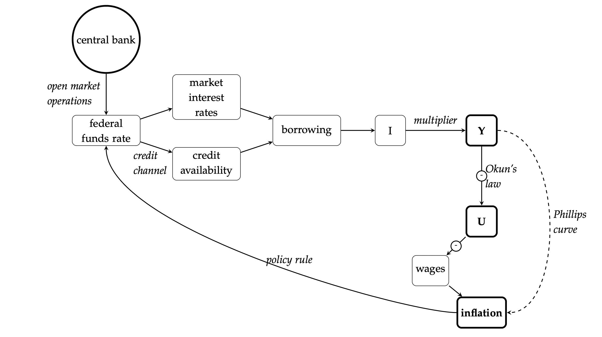

class: inverse, middle

```{r Setup, include = F}
options(htmltools.dir.version = FALSE)
library(pacman)
p_load(broom, latex2exp, ggplot2, ggthemes, ggforce, viridis, dplyr, magrittr, knitr, parallel, xaringanExtra, tidyverse, sjPlot, showtext, mathjaxr, ggforce, furrr, kableExtra, wooldridge, hrbrthemes, scales, ggeasy, patchwork,
       ggrepel)


# Knitr options
opts_chunk$set(
  comment = "#>",
  fig.align = "center",
  fig.height = 7,
  fig.width = 10.5,
  warning = F,
  message = F,
  dpi=300
)

theme_set(theme_ipsum_rc())

```


# Motivation


---

# Housekeeping

<br>

.b[Required readings]:

  - Case, Fair, & Oster (2012), ch. 8.
  
    - See *Extra Readings* module on `theSpring`.
  
---

# Aggregate expenditures


Last time, we started a more .hi[formal] approach to Macroeconomics.

--

Our starting point was .hi-orange[aggregate expenditures]:

<br>

.center[
*GDP = .b[C + I] + G + (X - M)*
]

--

<br>

We are currently assuming that aggregate consumption (*C*) depends only on the level of income (via the *marginal propensity to consume*), and that aggregate investment is equal to what firms have *planned.*

--

<br>

Now, it is time to study situations of .hi[equilibrium] in macroeconomic context.

---


layout: false
class: inverse, middle

# Equilibrium output


---

# Equilibrium output

In Economics, the notion of an .hi-orange[equilibrium] comes up whenever there is .b[no] tendency for .hi[change].

--

Let us take the market for *goods and services*, for instance.

  - Thus involving .hi[aggregate household consumption].
  
--

Whenever *total production* of a good (e.g., cars) is matched by *planned expenditures* on these goods, we are in .hi[equilibrium]. 

--

  - This way, both producers and consumers are satisfied.
  
--

Then, we can define these .hi[planned aggregate expenditures] (*AE*) as:

.center[
*AE &equiv; C + I*
]

--

> .hi[Planned aggregate expenditures] (*AE*) are the total value amount the economy plans to spend in a given period. It includes aggregate .hi-orange[consumption], as well as .hi-orange[planned investment] expenditures.

---

# Equilibrium output


In a closed economy with no government, an economy will be in .hi-orange[equilibrium] whenever aggregate output (*Y*) equals planned aggregate expenditures.

.center[
_Y = AE_
]


--

<br>

And since *AE &equiv; C + I*,

.center[
_Y = C + I_
]


--

<br>

At this point, it is important to remark that an economy will .hi-orange[hardly ever be] at this equilibrium state.

--

However, we benefit from this "*center of gravity*" for our practical purposes.

---

# Equilibrium output


What happens when

.center[
_Y > C + I ?_
]

--

Or when 


.center[
_C + I > Y ?_
]

--

<br>

In the first situation, firms planned to sell .hi[more] than they actually did.

  - This will be reflected in an .hi-orange[unplanned] change in inventories.
  
--

In the second, firms ended up selling more than what was planned.

  - Thus aggregate spending exceeds current output.

---

# Equilibrium output

Let us look at this issue through an .b[example].

--

Suppose the following aggregate consumption and planned investment functions, respectively:

.center[
*C = 150 + 0.8Y*

*I = 40*

]

<br>

--

  1. Is the economy in *equilibrium* when aggregate output (*Y*) equals $ 250?

  2. Is the economy in *equilibrium* when aggregate output (*Y*) equals $ 1,000?

  3. What is the output *equilibrium condition* for this economy?
  
  4. Graphically represent this economy, with aggregate *expenditures* on the vertical, and aggregate *output* on the horizontal axis.

---

layout: false
class: inverse, middle

# The *Saving  = Investment* condition

---

# The *Saving  = Investment* condition

Recall that the *fraction* of aggregate income that is not spent on consumption is .hi[saved].

--

.center[
*Y &equiv; C + S*
]

--

Taking the above equation with the .hi-orange[equilibrium condition]

.center[
*Y = C + I*
]


--

We have

.center[
*C + S = C + I*
]

--

Subtracting .hi[*C*]onsumption from both sides:

.center[
*S = I*
]

---

# The *Saving  = Investment* condition

What does the *S = I* condition tell?

--

  - It tells that only when .hi[planned investment equals aggregate saving] will the economy be in .hi-orange[equilibrium].
  
  
--

<br>

From our previous example, what is the *equilibrium* amount of saving?


---

layout: false
class: inverse, middle

# The multiplier


---

# The multiplier

So far, the total output of our economy equals its aggregate expenditures in equilibrium.

.center[
*Y = C + I*
]

--

From this, we can ask:

  - What happens to output if .hi[planned investment] changes from, say, *I<sub>1</sub> = $40* to *I<sub>2</sub> = $80*?
  
--

<br>

Now, aggregate planned expenditures exceed total output (*C + I > Y*), and firms will have their inventories reduced.

  - For instance, less unsold cars, computers, equipment, ...
  
---

# The multiplier


To respond to these decreased inventories, firms will have to .hi[increase output] and restore planned inventories.

--

This increased production helps to increase employment, and more people are earning income than before.

  - A large portion of this income will be spent on .hi-orange[consumption]!
  
--

Therefore, increasing aggregate investment also .hi[helps] to increase aggregate consumption.

--

<br>

As these events unfold, the economy will .hi[not] return to its previous .hi-orange[equilibrium], as the levels of consumption, investment, and output have changed.


---

# The multiplier

Recall that, as income rises, consumption also rises, but not in the same *proportion.*

--

With this new push in investment and the following increase in aggregate consumption, .hi[aggregate saving] (*S*) also tends to rise.

--

From a few slides ago, we saw that *S = I* is a .hi-orange[necessary condition] for equilibrium in an economy.

--

  - This means that any *new* investment must be .hi[compensated] with an equal increase in aggregate *saving.*


--

Therefore, *S* also has to rise to $80, so the economy is back in equilibrium.

--

Since .hi[added saving] is a fraction of .hi-orange[added income] (the *MPS*), the increase in income required to restore equilibrium must be .hi[*a multiple of the increase in planned investment*].

---

# The multiplier

Repeating:

  - Since .hi[added saving] is a fraction of .hi-orange[added income] (the *MPS*), the increase in income required to restore equilibrium must be .hi[*a multiple of the increase in planned investment*].
  
--

The marginal propensity to save is, by definition:

$$
\begin{aligned}
\text{MPS} = \dfrac{\Delta S}{\Delta Y}
\end{aligned}
$$

<br>

--

To restore equilibrium, *S = I*, so *&Delta;S = &Delta;I*. Then,

$$
\begin{aligned}
\text{MPS} = \dfrac{\Delta I}{\Delta Y}
\end{aligned}
$$


---

# The multiplier

Again:

$$
\begin{aligned}
\text{MPS} = \dfrac{\Delta I}{\Delta Y}
\end{aligned}
$$

<br>

--

Rearranging:

$$
\begin{aligned}
\Delta Y = \Delta I \times \dfrac{1}{\text{MPS}}
\end{aligned}
$$


Thus, the change in equilibrium income (*&Delta;Y*) is equal to the initial change in planned investment (*&Delta;I*) times *1/MPS*.

--

The .hi[multiplier] is, then, given by 

$$
\begin{aligned}
\dfrac{1}{\text{MPS}} \ \ \text{or} \ \ \dfrac{1}{1 - \text{MPC}}
\end{aligned}
$$


---


# From a few weeks ago...

.center[



]


.smallest[.left[By [`JW Mason`](http://jwmason.org/)]]


---


layout: false
class: inverse, middle

# Next time: Government expenditures & fiscal policy

---
exclude: true