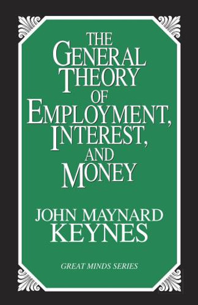

class: inverse, middle

```{r Setup, include = F}
options(htmltools.dir.version = FALSE)
library(pacman)
p_load(broom, latex2exp, ggplot2, ggthemes, ggforce, viridis, dplyr, magrittr, knitr, parallel, xaringanExtra, tidyverse, sjPlot, showtext, mathjaxr, ggforce, furrr, kableExtra, wooldridge, hrbrthemes, scales, ggeasy, patchwork,
       ggrepel)


# Knitr options
opts_chunk$set(
  comment = "#>",
  fig.align = "center",
  fig.height = 7,
  fig.width = 10.5,
  warning = F,
  message = F,
  dpi=300
)

theme_set(theme_ipsum_rc())

```


# Motivation


---

# Housekeeping

<br>

.b[Required readings]:

  - Case, Fair, & Oster (2012), ch. 8.
  
    - See *Extra Readings* module on `theSpring`.
  
---

# Macroeconomic modeling

<br>

Over the past weeks, we have studied the main .hi[macroeconomic measures]:

  - *Output* (GDP, GNP);
  
  - *(Un)employment* (unemployment rate, labor force, ...);
  
  - *Inflation* (CPI, Core CPI, GDP deflator, ...);
  
  - *Monetary policy* (interest rates, the role played by central banks, ...);
  
  - *International trade* (exchange rates, current account, balance of payments, ...). 
  


---

# Macroeconomic modeling


<br>

We have also studied how these variables are .hi-orange[connected]:

  - *Okun's law*;
  
  - *Phillips curve*;
  
  - The FED setting a target *federal funds rate*;
  
  - The trade balance and *debtor/creditor* status.

---


# Macroeconomic modeling


<br>

Now, we have enough background to put these pieces together and start .hi[modeling] the macroeconomy.

--

<br>

We will start .hi-orange[slowly].

  - First, we will focus on .hi[aggregate consumption and investment].
  
  - That is, expenditures made by .hi-orange[households and firms]. 
  
--

<br>

.center[
*GDP = .b[C + I] + G + (X - M)*
]


---

layout: false
class: inverse, middle

# Aggregate consumption


---

# Aggregate consumption

Starting off with .hi-orange[households], their expenditures on *goods* and *services* represent almost .b[70%] of total US GDP.

--

[`Official data`](https://fred.stlouisfed.org/series/DPCERE1Q156NBEA)

--

<br>

For you as a household, what is the .hi[most important economic factor] determining your *how much* you consume?

--

<br>

- And what are some .it[secondary] factors?


---

# Aggregate consumption

.pull-left[
John Maynard Keynes (1883&mdash;1946) formalized the idea that .hi[personal income] is the most relevant factor determining one's consumption, thus being important at the .hi-orange[aggregate level] as well.
]


.pull-right[

]


---

# Aggregate consumption


.pull-left[
In *The General Theory of Employment, Interest, and Money* (1936), Keynes wrote:

> *"The fundamental psychological law, upon which we are entitled to depend with great confidence both a priori from our knowledge of human nature and from the detailed facts of experience, is that men [and women, too] are disposed, as a rule and on average, to __increase their consumption as their incomes increase, but not by as much as the increase in their income__."*
]

.pull-right[

]


---

# Aggregate consumption


<br><br>

Keynes is pointing out .hi-orange[two] main things:

  1. Consumption tends to *increase* with income;
  
  2. Their relationship is positive, but consumption does not increase by the *same proportion* as one's income.


--

<br>

And this applies both at the .hi[micro] and at the .hi-orange[macroeconomic] levels!

---

# Aggregate consumption

With Keynes' idea in mind, how do we .hi[formalize] this theory?

--

  - In other words, how do we .hi-orange[model] this situation *mathematically*?

--

Let us start by thinking in graphical terms.

```{r, echo=FALSE, message=FALSE, warning=FALSE, dev='svg', fig.height = 4, fig.width=6}


dat <- tibble(
  y = c(0,80,100,200,400,600,800,1000),
  c = c(100, 160, 175, 250, 400, 550, 700, 850)
)

dat %>% 
  ggplot(aes(y = c, x = y)) +
  geom_line(color = "#20b2aa", size = 1.5) +
  scale_y_continuous(breaks = seq(-100, 800, by = 500), labels = NULL) +
  scale_x_continuous(labels = NULL) +
  expand_limits(y = -50) +
  geom_hline(yintercept = 0) +
  geom_vline(xintercept = 0) +
  labs(y = "Aggregate consumption",
       x = "Aggregate Income") +
  easy_x_axis_title_size(13) +
  easy_y_axis_title_size(13)


```

---


# Aggregate consumption

Since we are assuming that aggregate consumption only depends on aggregate income, we may call the .hi[consumption function] *C(Y)*.

--

And put in an equation form:

.center[
*C = a + bY*
]


--

<br>

- What do *a* and *b* represent here?


---


# Aggregate consumption

Every time income *increases* (call it *&Delta;Y*), consumption will *also increase* (call it *&Delta;C*).

--

Thus, .hi-orange[how much] consumption changes when income changes can be given by

<br>

$$
\begin{aligned}
\dfrac{\Delta C}{\Delta Y}
\end{aligned}
$$

<br>

In other words, this is the .hi-orange[fraction] of a change in aggregate income that is spent on consumption.

--


In economic terms, this fraction is called the .hi[marginal propensity to consume] (*MPC*).


--

As an example, if income increases by $200 (*&Delta;Y = 200*), an .hi[MPC] of .5 means that consumption increases by _0.5 * 200 = 100_.

---


# Aggregate consumption


From a graphical perspective, the .hi[marginal propensity to consume] is equivalent to the consumption function's .hi-orange[slope].

If its value is *less than* .b[1], Keynes' claim is .it[verified]: individuals spend less than 100 percent of their income increase in consumption.

```{r, echo=FALSE, message=FALSE, warning=FALSE, dev='svg', fig.height = 3.75, fig.width=6}


dat <- tibble(
  y = c(0,80,100,200,400,600,800,1000),
  c = c(100, 160, 175, 250, 400, 550, 700, 850)
)

dat %>% 
  ggplot(aes(y = c, x = y)) +
  geom_line(color = "#20b2aa", size = 1.5) +
  scale_y_continuous(breaks = seq(-100, 800, by = 500), labels = NULL) +
  scale_x_continuous(labels = NULL) +
  expand_limits(y = -50) +
  geom_hline(yintercept = 0) +
  geom_vline(xintercept = 0) +
  labs(y = "Aggregate consumption",
       x = "Aggregate Income") +
  easy_x_axis_title_size(13) +
  easy_y_axis_title_size(13)


```


---


layout: false
class: inverse, middle

# Aggregate saving


---


# Aggregate saving


The portion of one's income that is .b[not] spent on consumption is .hi-orange[saved].

--

From an .hi[aggregate] perspective, the part of aggregate income (*Y*) that is not consumed (*C*) becomes .hi-orange[aggregate saving] (*S*).


.center[
*S &equiv; Y - C*
]

<br>

--

Notice that the "equivalent to" sign (*&equiv;*) means an .hi[identity] (something that is always true).

--

Thus, the .hi-orange[marginal propensity to save] (MPS) is equal to

.center[
*MPS &equiv; 1 - MPC*
]

--

MPS is the fraction of an increase in income that is *saved* (or the fraction of a decrease in income that comes out of saving).

---


# Aggregate saving


<br>

Using the aggregate .hi[consumption] (vertical) and aggregate .hi[income] (horizontal) plane, do the following:

- Draw a 45<sup>o</sup> line;

- Then, assume an aggregate consumption function *C = 100 + .75Y*.

--
  - *Add* this consumption function to the graph;
  
  - What are the *marginal propensities to consume* for both lines?
  
  - Compare consumption and saving values when the lines *intersect* and when one is *above* (*below*) the other.

---

layout: false
class: inverse, middle

# Planned investment


---

# Planned investment

.hi-orange[Consumption] of goods and services are a major part of aggregate expenditures.

--

However, .hi[investments] made by *firms* are also part of the economy's output.

--

Recall that .hi-orange[aggregate investment] includes

  - Purchases of machinery, equipment;
  
  - Structures;
  
  - Software, research & development;
  
  - Residential investment.


--

[`Official US data`](https://fred.stlouisfed.org/series/A006RE1Q156NBEA)

--

In addition to these items, aggregate investment also includes .hi[changes in inventories].


---

# Planned investment

A firm’s .hi-orange[inventory] is the stock of goods that it has *awaiting* *sale.*

--

There are several .hi[reasons] for firms wanting to hold inventories:

  - Cheaper to produce in larger volumes;
  
  - Unexpected changes in consumer behavior;
  
  - The current economic scenario.


--

<br>

That being said, while the firm's decisions to purchase new machinery or to hold inventories are .hi[deliberate], sometimes inventories build up (or decline) .hi-orange[without any deliberate plan] by firms.

--

For this reason, there can be a difference between .hi[planned] and .hi-orange[actual] investment.

---

# Planned investment

For simplicity's sake, we will assume for now that aggregate investment equals .hi[planned] investment.

--

Thus, we will .b[not] account for differences between actual and planned investment.

  - Later on, we will *relax* this assumption.


--


In practice, this means that firms’ planned investment is .hi[fixed] and .b[does not] depend on income.

--

```{r, echo=FALSE, message=FALSE, warning=FALSE, dev='svg', fig.height = 3.25, fig.width=5}


dat %>% 
  ggplot(aes(y = c, x = y)) +
  scale_y_continuous(breaks = seq(0, 800, by = 500), labels = NULL) +
  scale_x_continuous(breaks = seq(-500, 800, by = 100), labels = NULL) +
  #expand_limits(y = -0) +
  #expand_limits(x = 0) +
  #geom_hline(yintercept = 0) +
  geom_hline(yintercept = 5, color = "#66023c", size = 1.5) +
  #geom_vline(xintercept = -500) +
  labs(y = "Aggregate investment",
       x = "Aggregate Income") +
  easy_x_axis_title_size(13) +
  easy_y_axis_title_size(13)


```


---

layout: false
class: inverse, middle

# Next time: Equilibrium; the multiplier

---
exclude: true