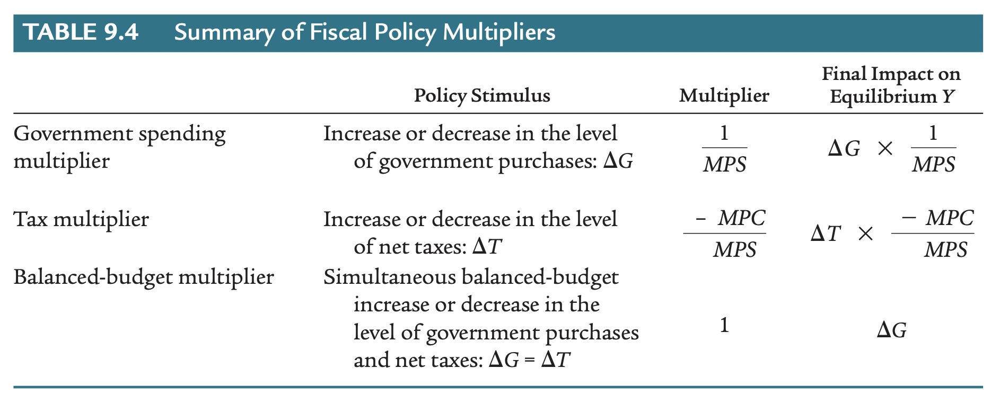

class: inverse, middle

```{r Setup, include = F}
options(htmltools.dir.version = FALSE)
library(pacman)
p_load(broom, latex2exp, ggplot2, ggthemes, ggforce, viridis, dplyr, magrittr, knitr, parallel, xaringanExtra, tidyverse, sjPlot, showtext, mathjaxr, ggforce, furrr, kableExtra, wooldridge, hrbrthemes, scales, ggeasy, patchwork,
       ggrepel)


# Knitr options
opts_chunk$set(
  comment = "#>",
  fig.align = "center",
  fig.height = 7,
  fig.width = 10.5,
  warning = F,
  message = F,
  dpi=300
)

theme_set(theme_ipsum_rc())

```


# Motivation


---

# Housekeeping

<br>

.b[Required readings]:

  - Case, Fair, & Oster (2012), ch. 9.
  
    - See *Extra Readings* module on `theSpring`.
    
    
.b[For the next lecture]:

  - Yahoo! Finance on the "*Inflation Reduction Act*"
  
    - [`Youtube link here (watch the "key moments"`)](https://www.youtube.com/watch?v=UJ-vP063Yww&ab_channel=YahooFinance)
  
---

# Government: Good or bad for the economy?


The .hi[role of the government] in a country's economy is a matter of great *debate.*

--

<br>

Regardless of one's view abut the role of the government, it performs several .hi-orange[functions], including:

  - Setting *minimum wages*;
  
  - Regulating *product quality*;
  
  - Providing and maintaining public *schools*, *parks*, *health programs*, etc.
  
--

From a .hi[macroeconomic] perspective, the government (be that *local*, *state*, or *federal* instances) acts in the economy through two main channels:

  1. .hi-orange[Fiscal] policy;
  
  2. .hi[Monetary] policy.
  
---

# Government: Good or bad for the economy?

.hi[Fiscal] policy refers to a government's *spending* and *taxing* practices.

--

  - In other words, how the government manages its own .hi-orange[budget].


--

We may divide fiscal policy into three main categories:

  1. Government *expenditures* on goods and services;
  
  2. *Tax* policies;
  
  3. *Transfer* payments (veteran benefits, Social Security, unemployment compensation,...).
  
--

<br>

On the other hand, .hi-orange[monetary] policy involves how the government, through its central bank, manages a country's .hi[supply of money].

---

layout: false
class: inverse, middle

# Government variables

---

# Government variables


From now on, we will add the .hi[government] to our formal analysis of an economy.

--

In other words, we are now treating a still *closed* economy, but *with* government.

--

<br>

Thus, its .hi[aggregate expenditures] (*AE*) are defined by:

<br>

.center[
*AE &equiv; C + I + G*
]

<br>

where *G* includes government expenditures.


---

# Government variables

Now, turning to .hi-orange[aggregate output] (*Y*), we will define a new variable, called .hi[net taxes] (*T*).

  - *T* accounts for taxes collected by the government and its transfer payments.


--

<br>

Since now we are considering the role of government in the macroeconomy, it takes a .hi-orange[portion] of household income flows in the form of taxes.

--

Therefore, the income that *ultimately* gets to households is known as .hi[disposable (after-tax)] income, *Y<sub>d</sub>*:

.center[
*Y<sub>d</sub> &equiv; Y - T*
]

<br>

where *Y<sub>d</sub>* *subtracts* taxes paid by households and *includes* any transfer payments that these receive from the government.
---

# Government variables

Now, households' *disposable income* must be either spent on .hi[consumption] or .hi-orange[saved].

<br>

.center[
*Y<sub>d</sub> &equiv; C + S*
]

<br>

--

And since *Y<sub>d</sub> &equiv; Y - T*,


.center[
*Y - T &equiv; C + S*
]

--

Rearranging,

.center[
*Y &equiv; C + S + T*
]

--

This last identity says that aggregate output is .hi[split] between *net taxes*, household *consumption*, and *savings.*

---

# Government variables

Whenever a government's expenditures (*G*) are .hi-orange[larger] than what it collects in net taxes (*T*), the government runs a .hi[budget deficit].

--

.center[
*Budget deficit = G - T*
]

--

  - If *G > T*, budget *deficit*;
  
  - If *G < T*, budget *surplus.*
  
  
--

<br>

In case *G* exceeds *T*, the government must finance this deficit by .hi-orange[borrowing] from the public.

  - Via Treasury bonds, bills,...
--

  - This way, part of .hi[aggregate savings] (*S*) goes to financing budget deficits.

---

# Government variables

Before considering the government, our aggregate consumption function looked like:

.center[
*C = a + bY*
]

--

Now, we simply replace total income (*Y*) by .hi-orange[disposable income], *Y<sub>d</sub>*:

.center[
*C = a + bY<sub>d</sub>*
]

--

or

.center[
*C = a + b(Y - T)*
]

--

<br>

For now, we still consider that .hi[aggregate investment] (*I*) *does not* depend on income (meaning that *planned* investment equals *actual* investment.)


---

layout: false
class: inverse, middle

# Equilibrium

---

# Equilibrium

<br>

From our previous lectures, we saw that a .hi[macroeconomic equilibrium] happens when

.center[
*Y = AE*
]

<br>

That is, when .it[aggregate output] (*Y*) is .hi-orange[equal] to planned .it[aggregate expenditures] (*AE*).

--

<br>

And this is equivalent to 

.center[
*Y = C + I + G*
]

---

# Equilibrium

Assume the following:

  - An aggregate consumption function *C = 150 + .80Y<sub>d</sub>*;
  - Government expenditures *G = 100*;
  - The government has a *balanced budget*, meaning that its spending is fully financed by taxes (*T*);
  - Planned investment *I = 150*.

--

Now, we can ask some .hi[questions]:

- If aggregate output (*Y*) is $ 500, what is the level of .b[disposable income] of this economy?

- When output (*Y*) is $ 500, is the economy in .b[equilibrium]?

- When output (*Y*) is $ 1,800, is the economy in .b[equilibrium]?

- What is the .b[equilibrium level] of output for this economy?


---

layout: false
class: inverse, middle

# *Saving = Investment* revisited

---

# *Saving = Investment* revisited

In previous lectures, we saw that the *equality* between aggregate saving and investment is a .hi[necessary condition] for equilibrium.

--

Now that *government expenditures* and *taxes* play a role in the economy, we may .hi-orange[revisit] this condition.

--

Consider the .hi[income flow] in the economy as the amount of money households, firms, and the government spend.

--

  - For consumption, we have assumed that household spending is guided by the .hi[marginal propensity to consume] (a fixed value between 0 and 1).
  - And new .hi-orange[injections] in the economy come either from planned .hi[investment] (*I*) or .hi[government expenditures] (*G*).
  - However, the government also takes out .hi[taxes] (*T*) from this flow of income, and households usually .hi[save] some of their income.
  - Thus, taxes and saving can be considered .hi-orange[leakages] from the flow of income.
    

---

# *Saving = Investment* revisited

Therefore, the .hi-orange[equilibrium condition] when there is government in the economy becomes

.center[
*S + T = I + G*
]

--

In words, the volume of .hi-orange[leakages] (*S + T*) must be .hi[compensated] with planned .hi-orange[injections] (*I + G*) in the economy to achieve .hi[equilibrium].

<br>

Notice that, now, equilibrium .hi[does not] require a balanced government budget (*G = T*) or an equality between aggregate saving and investment (*S = I*) to be achieved. 

  - The equality must be between .hi[leakages] and .hi[injections]!
  
--

<br>

From our previous example, is this condition satisfied in .hi-orange[equilibrium]?

---

layout: false
class: inverse, middle

# Fiscal policy & multiplier effects

---

# Fiscal policy & multiplier effects

When we consider the .hi[government] in the macroeconomy, we see that output can be changed by either changing the levels of .hi-orange[government expenditures] (*G*) or .hi-orange[net taxes] (*T*) (or both simultaneously).

--

Whenever changing .hi[any] of these variables, the government is engaging in .hi-orange[fiscal policy].

--

<br>

Fiscal policy can generate .hi[three] types of .hi-orange[multiplier] effects in the economy, namely:

  1. The .b[government spending] multiplier;
  
  2. The .b[tax] multiplier;
  
  3. And the .b[balanced-budget] multiplier.

---

# Fiscal policy & multiplier effects

Suppose .hi[policymakers] are faced with the following situation:

--

  - The economy must be .hi[stimulated] (i.e., aggregate output must grow to reduce unemployment, for example).
  
  - Taxes .hi-orange[cannot] be changed (due to a recent tax reform package, for example).
  
--


How can the government increase aggregate spending .hi-orange[without] changing the tax regime?


--

Say that we have the same setup from before:

  - *C = 150 + 0.8Y<sub>d</sub>*;
  - *I = 150*
  - *G = 100*
  - *T = 100*

--

The goal is to increase output by $ 200 (*&Delta;Y = 200*).

---

# Fiscal policy & multiplier effects

With aggregate investment and the tax regime remaining unchanged, .hi[government expenditures] are capable of generating .hi-orange[multiplier] effects.

--


This is the .hi[government expenditures multiplier].

--

> The .hi[government expenditures multiplier] is the ratio of the change in the equilibrium level of output to a change in .hi-orange[government spending].


--

<br>


$$
\begin{aligned}
\text{Government expenditures multplier} = \dfrac{1}{\text{MPS}} \ \ \text{or} \ \ \dfrac{1}{1 - \text{MPC}}
\end{aligned}
$$


--

<br><br>

From our example, what is the government expenditures multiplier?

---

# Fiscal policy & multiplier effects

Now, assume that a policymaker has the task of increasing aggregate output by $ 200 (as before), but .hi-orange[without] increasing government expenditures (*G*).


--

The remaining fiscal policy instrument is .hi[taxation].


--

  - Thus, a .hi[tax cut] takes place.
  
--

<br><br>


Using our example economy, what tax cut is necessary to increase aggregate output by $ 200?


---

# Fiscal policy & multiplier effects

> The .hi[tax multplier] is the ratio of change in the equilibrium level of output to a change in taxes.

--

<br>

$$
\begin{aligned}
\text{Tax multplier} = -\bigg(\dfrac{\text{MPC}}{\text{MPS}}\bigg)
\end{aligned}
$$

--

<br>

Given that a tax *cut* will cause an *increase* in consumption expenditures and output and a tax *increase* will cause a *reduction* in consumption expenditures and output, the tax multiplier is a negative number.


---

# Fiscal policy & multiplier effects

Now, what happens if government spending and taxes are increased .hi[by the same amount]?

--

In other words, the government decides to pay for its extra spending by increasing taxes by the same amount, thus keeping the government's budget .hi-orange[deficit unchanged].

--

  - What is the effect on the equilibrium level of output, in case the goal is to increase output by $ 200?


---

# Fiscal policy & multiplier effects


> The .hi[balanced-budget multiplier] is the ratio of change in the equilibrium level of output to a change in government spending where the change in government spending is balanced by a change in taxes so as .hi-orange[not to create any deficit].

--

<br>

$$
\begin{aligned}
\text{Balanced-budget multplier} = 1
\end{aligned}
$$

--

<br>

In words, the change in *Y* resulting from the change in *G* and the equal change in *T* are exactly the same size as the initial change in *G* or *T.*

---

# Fiscal policy & multiplier effects

A nice summary:

.center[



]

---

layout: false
class: inverse, middle

# Next time: Recent fiscal policies in the US

---
exclude: true