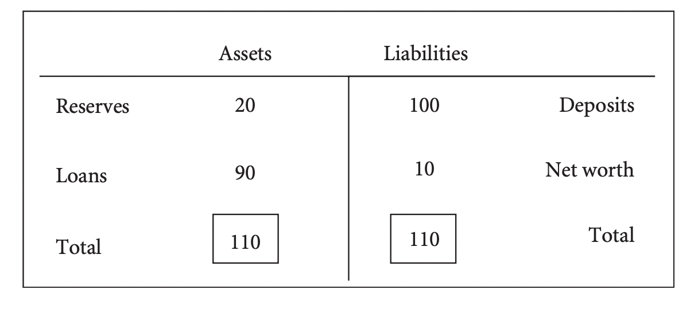

class: inverse, middle

```{r Setup, include = F}
options(htmltools.dir.version = FALSE)
library(pacman)
p_load(broom, latex2exp, ggplot2, ggthemes, ggforce, viridis, dplyr, magrittr, knitr, parallel, xaringanExtra, tidyverse, sjPlot, showtext, mathjaxr, ggforce, furrr, kableExtra, wooldridge, hrbrthemes, scales, ggeasy, patchwork,
       ggrepel)


# Knitr options
opts_chunk$set(
  comment = "#>",
  fig.align = "center",
  fig.height = 7,
  fig.width = 10.5,
  warning = F,
  message = F,
  dpi=300
)

theme_set(theme_ipsum_rc())

```


# Motivation


---

# Housekeeping

<br>

.b[Required readings]:

  - [`OpenStax, ch. 14`](https://openstax.org/books/principles-macroeconomics-2e/pages/14-introduction-to-money-and-banking)


  
---

layout: false
class: inverse, middle

# Functions of money


---

# Functions of money

Market economies .hi-orange[cannot] function without money.

--

As an alternative to a .hi[monetary economy], consider a .hi-orange[barter] economy.

  - Where there is *direct exchange* of goods and services for other goods and services.
  
--

<br>

A barter system requires a ".hi[double coincidence of wants]" for trade to take place.

  - It is impossible to guarantee that all parts will be made better off after an exchange.
  
--

<br>

.hi[Money] *solves* the problems that the barter system creates.

  - In other words, money serves as a .hi[means] through which all those involved in the exchange process will satisfy their needs .hi-orange[after] any transaction takes place.


---

# Functions of money

Since the use of money gets rid of the "double coincidence of wants" problem, it has .hi[three main functions]:

--

1. Medium of exchange;
2. Store of value;
3. Unit of account.

--

<br>

Starting with a .hi[means of exchange], money is what sellers generally accept and buyers generally use to pay for goods and services.

  - Money serves as the .hi-orange[*intermediary*] between the buyer and the seller.


---

# Functions of money

Money also performs the role of .hi[storing value] (i.e., holding wealth).

  - It is an .hi-orange[*asset*] that can be used to transport .hi[purchasing power] from one time period to another.
  
--

There are many other stores of value besides money, but none is as .hi-orange[liquid] as money.

--

<br>

Thus, functions (1) and (2) comprehend the .hi[liquidity property of money].

--

> The .hi-orange[liquidity property of money] makes it a medium of exchange as well as a store of value, being portable and readily accepted, thus easily exchanged for goods and services.


--

<br>

In .hi[inflationary] periods, the most affected function of money is of *storing value*.

  - Why?

---

# Functions of money

<br><br><br>

Lastly, money also serves as a .hi-orange[unit of account].

  - Money is a consistent way of *quoting prices*.
  
  - It serves as the standard unit of account from sandwiches to mansions.

---


layout: false
class: inverse, middle

# Money supply 


---

# Money supply 

Before our well-known .hi[paper] money, several other items have been used throughout history as money instruments.

--

From *cigarettes* to *gold*, any item used as money that also has an .hi-orange[intrinsic value] in some *other* use is considered a .hi[commodity money].

--

<br>

Nowadays, economies use .hi[fiat] (*aka* .hi[token]) money.

  - Meaning that our dollar bills, for instance, have .hi-orange[no intrinsic value].
  
  - However, governments have declared fiat money as .hi[legal tender].
    
    - Its money must be accepted in *settlement of debts*.


---

# Money supply 

Money goes .hi-orange[beyond] dollar bills, though.

--

The functions of *storing value*, *holding wealth*, and *quoting prices* apply to a wider range of assets other than dollar bills.

--

<br>

We now turn our attention to different .hi[measures of money].

--

Beyond others that are not too important for our current purposes, we will see the main .hi[two]:

  - .hi[M1] (*transactions* money);
  
  - .hi[M2] (*broad* money).

---

# Money supply 

.hi[M1] comprehends all monies that can be .hi-orange[directly] used for transactions.

--

  - Including any money held .hi[outside of banks], traveler's .hi-orange[checks], and bank (checkable) .hi[deposits]. 
  
  - Thus, M1 includes the most .hi-orange[liquid] forms of money.

--

<br>

.hi[M2], on the other hand, includes .hi-orange[less liquid] assets.

  - *Savings* and *time* deposits, certificates of deposits, and money market *funds.*
  
---

# Money supply 


<br><br>

[`M1 in the United States`](https://fred.stlouisfed.org/series/M1SL)


<br>

[`M2 in the United States`](https://fred.stlouisfed.org/series/M2SL)


---

layout: false
class: inverse, middle

# Money creation

---

# Money creation

How do *banks* .hi[create] money?

--

Banks keep their books in the following way:

<br>

.center[
*Bank Assets - Bank Liabilities &equiv; Bank's Net Worth*
]

<br>

--

.hi-orange[Assets] are what the bank owns that are worth something.

  - Its building(s), furniture, holdings of government securities, cash in vaults, bonds, stocks,...;
  - Its *deposits* with the country's Central Bank (the FED in the case of the United States);
  - Most importantly, the .hi[loans] it makes to borrowers

---

# Money creation

The bank's .hi[liabilities] are its *debts.*

--
  - The most important one being its .hi-orange[deposits].
  
  - A bank's deposits are basically *loans* made by its clients to the bank.


--

<br>

Finally, the bank's .hi-orange[net worth] is the *difference*  between its assets and liabilities.

  - In other words, the difference between what it *owns* and what it *owes.*


---

# Money creation

A simple .hi[T-account] can help us illustrate a bank's financial position:

.center[



]

--

Notice that a portion of this toy bank's *assets* are .hi[reserves].

  - These include deposits that a bank has at the Central Bank *plus* its cash on hand.
  
--


  
---
# Money creation

In several economies, banks are *legally* required to hold reserves at the country's Central Bank.

--

The percentage of its deposits that a bank must keep as reserves is known as the .hi[required reserve ratio].

--

<br>

Banks .hi[earn income] by lending money out at a higher interest rate than they pay depositors for use of their money.

--

Thus, these usually make loans .hi-orange[up to the point] where they can no longer do so due to the legal reserve requirement restriction.

--


Then, a bank's .hi[excess reserves] are the difference between its actual reserves and the legally required reserves.

.center[
*Excess &equiv; Current + Required Reserves*
]

---

layout: false
class: inverse, middle

# The money multiplier

---

# The money multiplier

The more .hi[deposits] a bank receives, the .hi-orange[higher] its *actual* reserves will be relative to its *required* reserves.

--

This way, an increase in bank reserves can lead to a .hi[more than proportional] increase in the money supply. 

--

Economists call the relationship between the final change in deposits and the change in reserves that caused this change the .hi[money multiplier].

--

> The .hi-orange[money multiplier] is the *multiple* by which deposits can increase for every dollar increase in reserves.

--

<br>

It basically tells us by how many times a loan will be “*multiplied*” as it is spent in the economy and then re-deposited in other banks.

---

# The money multiplier


The .hi[money multiplier] can be calculated by

$$
\begin{aligned}
\text{Money multiplier} = \dfrac{1}{\text{Required Reserve Ratio (%)}}
\end{aligned}
$$

---

# The money multiplier

Example

ps: how does this relate to m1 for hands-on


---

# The money multiplier

<br><br>

In 2020, the US FED decided to reduce banks' reserve requirement to .hi[zero].

[`Official data`](https://fred.stlouisfed.org/series/RESBALREQW)

--

<br><br>

What does this imply for the multiplier?

---

layout: false
class: inverse, middle

# Next time: The demand for money 

---
exclude: true